# Project - Phase 2

| Name             | Student Number |
| ---------------- | -------------: |
| Diogo Martins    |        1221223 |
| Francisco Osorio |        1220846 |
| Joao Pinto       |        1220663 |
| Francisco Reis   |        1201373 |
| Marco Marques    |        1250685 |

# Introduction

In this report, its presentend the phase 2 of the DESOFS project, which consists in documenting operations related to the development process, CI/CD pipeline and security practices.

The main topics covered in this report include the development process and conventions, such as commit message strategy, pull request guidelines, code review process, branch naming strategy and the CI/CD pipeline.

# Development Process & Conventions

To maintain high code quality, improve collaboration, and ensure consistency across the team, we have established a comprehensive set of development conventions and processes. These guidelines cover how we structure our commits, manage pull requests, conduct code reviews, and organize our branching strategy. By adhering to these practices, we ensure that our codebase remains clean, maintainable, and easy to navigate for all team members.

## Commit Message Strategy

Our team follows the conventional commits format to maintain clear and consistent commit history. The structure of our commit messages is:

```
<type>: <description>
```

Where `<type>` can be:

- **feat**: A new feature or functionality
- **fix**: A bug fix
- **docs**: Documentation changes
- **refactor**: Code refactoring without changing functionality
- **test**: Adding or updating tests
- **chore**: Maintenance tasks and dependencies

**Example:**

```
feat: implement user authentication system
fix: resolve login validation bug
docs: update API documentation
```

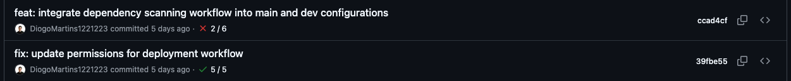

This convention ensures that the commit history is readable, searchable, and can be automated for changelog generation.

## Pull Request Guidelines

Each pull request should follow these guidelines to ensure quality and clarity:

1. **Title**: A clear and descriptive title that summarizes the changes
   - Should be concise and match the commit convention when possible
   - Example: "feat: implement user authentication" or "fix: resolve database connection issue"

2. **Description**: A comprehensive description of what was developed
   - Main points and changes implemented
   - Motivation or reason for the changes
   - Any relevant context for reviewers

3. **Assignment**:
   - Assign the PR to the developer who created it
   - This ensures clear responsibility and accountability

4. **Reviewers**:
   - Add team members who should review the code
   - Include Copilot for automated code analysis when relevant

5. **Labels**: Use appropriate labels (e.g., bug, enhancement, documentation) to categorize the PR

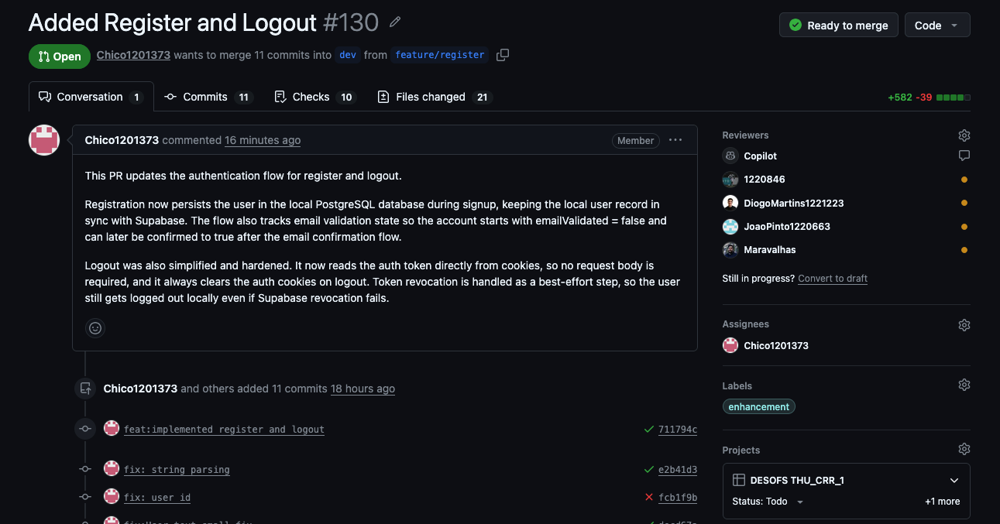

## Code Review Process

Our code review process ensures code quality and knowledge sharing across the team:

1. **Review Requirements**:
   - A minimum of **one approval** is required before merging a PR
   - All conversations and suggested changes must be addressed

2. **Reviewer Responsibilities**:
   - Examine code for correctness, style, and best practices
   - Verify that the changes align with project requirements
   - Check for potential bugs, performance issues, and security vulnerabilities
   - Provide constructive feedback and suggestions for improvement

3. **Automated Reviews**:
   - **GitHub Copilot** is integrated into the review process
   - Copilot provides automated code analysis and suggestions
   - Helps identify issues and improves code quality
   - Complements manual reviews by developers

4. **Approval & Merge**:
   - Once the PR is approved and all checks pass, the PR can be merged
   - The author or reviewer can perform the merge

## Branch Merging Strategy

Our team follows a controlled merging strategy to ensure stability and quality across branches:

1. **Development Flow**:
   - Feature branches (`feat/`, `fix/`, etc.) are created from the `dev` branch
   - PRs from feature branches are merged into the `dev` branch after approval

2. **Dev Branch**:
   - Acts as an integration branch for all features and fixes
   - All changes are tested and validated in the dev environment
   - Must be in a working, stable state at all times

3. **Main Branch Deployment**:
   - Once all changes are working correctly on the `dev` branch
   - A final PR is created to merge `dev` into `main`
   - This ensures `main` always contains production-ready code
   - Deployments to production are made from the `main` branch

4. **Branch Hierarchy**:
   ```
   feature/something --> dev --> main
           (PR #1)     (PR #2)
   ```

## Branch Naming Strategy

Branch names follow a structured format similar to commits to maintain consistency and clarity:

```
<type>/<description>
```

Where `<type>` matches the commit type:

- **feat/**: Feature branches (e.g., `feat/user-authentication`)
- **fix/**: Bug fix branches (e.g., `fix/login-validation`)
- **docs/**: Documentation branches (e.g., `docs/api-guide`)
- **refactor/**: Refactoring branches (e.g., `refactor/database-layer`)
- **test/**: Test branches (e.g., `test/integration-tests`)
- **chore/**: Maintenance branches (e.g., `chore/update-dependencies`)

**Examples:**

- `feat/payment-integration`
- `fix/session-timeout-bug`
- `docs/setup-instructions`

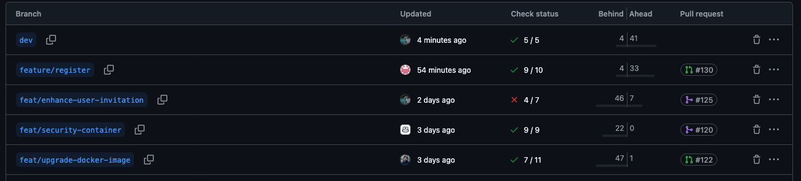

This naming convention makes it easy to identify the purpose of a branch and correlate it with related commits and PRs.

# CI/CD Pipeline

## Pipeline Overview

Our CI/CD pipeline follows a structured approach with different workflows triggered at different stages of the development process:

- **Feature pipeline**: Runs for feature branches and pull requests. Provides fast feedback with build, unit tests, integration tests and some security scans. Triggered on PR creation and pushes to feature branches to catch regressions early and speed up development.
- **Dev pipeline**: Targets the `dev` branch. Runs faster but thorough checks (build, tests, and soma security scans). Triggered on pushes to `dev`.
- **Main pipeline**: Protects the `main` branch. Runs a build, unit and integration tests, SAST/DAST, container security scans, and release tasks. Triggered on pushes and merged pull requests to `main` to ensure production-grade artifacts and safe deployments.

Benefits:

- **Faster feedback**: Feature pipelines give quick results so developers can iterate faster.
- **Safer releases**: The main pipeline enforces comprehensive testing and security scans before production.
- **Clear separation of concerns**: Dev pipeline supports integration testing without blocking the main branch.
- **Efficient CI usage**: Heavy scans and deployments run only where needed, reducing CI time and cost.

### Example of workflow run to feature branch

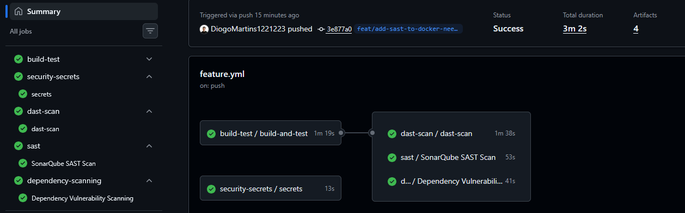

### Example of workflow run to dev branch

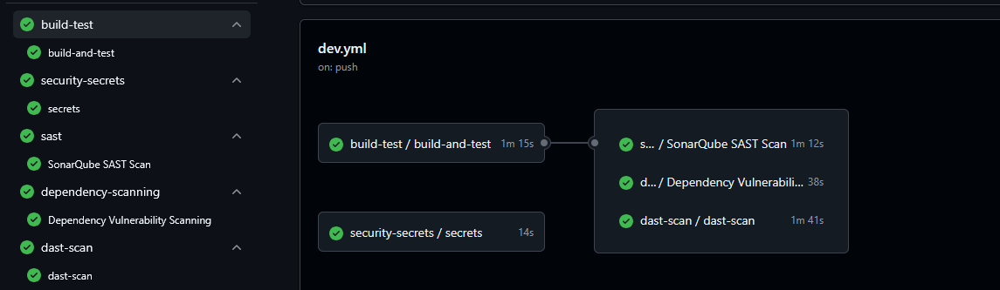

### Example of workflow run to main branch

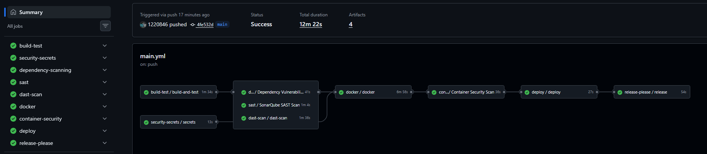

## Build & Test

The build and test pipeline is implemented as a reusable GitHub Actions workflow ([build-test workflow](../.github/workflows/build-test.yml)) and runs the project build, unit tests, integration tests and collects coverage reports. The workflow is invoked by main, dev and feature pipelines.

### Workflow Implementation

```yaml
- name: Build
   working-directory: backend
   run: mvn clean compile

- name: Unit Tests
   working-directory: backend
   run: mvn test

- name: Integration Tests + Coverage
   working-directory: backend
   run: mvn verify

- name: Upload coverage
   uses: actions/upload-artifact@v4
   with:
      name: jacoco-report
      path: backend/target/site/jacoco
```

### Maven Configuration

Maven configuration in [`pom.xml`](../backend/pom.xml) defines the test execution and coverage collection:

- `maven-surefire-plugin` (unit tests):

```xml
<plugin>
   <groupId>org.apache.maven.plugins</groupId>
   <artifactId>maven-surefire-plugin</artifactId>
   <version>3.2.5</version>
   <configuration>
      <excludes>
         <exclude>**/*IntegrationTest.java</exclude>
      </excludes>
   </configuration>
</plugin>
```

- `maven-failsafe-plugin` (integration tests):

```xml
<plugin>
   <groupId>org.apache.maven.plugins</groupId>
   <artifactId>maven-failsafe-plugin</artifactId>
   <version>3.2.5</version>
   <executions>
      <execution>
         <goals>
            <goal>integration-test</goal>
            <goal>verify</goal>
         </goals>
         <configuration>
            <includes>
               <include>**/*IntegrationTest.java</include>
            </includes>
         </configuration>
      </execution>
   </executions>
</plugin>
```

- `jacoco-maven-plugin` (coverage):

```xml
<plugin>
   <groupId>org.jacoco</groupId>
   <artifactId>jacoco-maven-plugin</artifactId>
   <version>0.8.11</version>
   <configuration>
      <excludes>
         <exclude>com/techstore/app/bootstrapping/**</exclude>
         <exclude>com/techstore/app/client/**</exclude>
         <exclude>com/techstore/app/config/**</exclude>
         <exclude>com/techstore/app/dto/**</exclude>
      </excludes>
      <rules>
         <rule>
            <element>BUNDLE</element>
            <limits>
               <limit>
                  <counter>LINE</counter>
                  <value>COVEREDRATIO</value>
                  <minimum>0.60</minimum>
               </limit>
            </limits>
         </rule>
      </rules>
   </configuration>
</plugin>
```

Notes:

- The project separates unit tests (Surefire) from integration tests (Failsafe) using the `*IntegrationTest.java` naming convention. This allows the workflow to run fast unit test passes and then run integration tests and coverage in a later `mvn verify` step.
- JaCoCo is configured to produce a coverage report and enforce a minimum line coverage ratio of 60%.

## Security Secrets Management

Secret scanning is a critical security practice that automatically detects exposed credentials, tokens, and other sensitive data in the repository. Our team uses **Gitleaks** to perform secret scanning. The scanning process is triggered on every workflow call and targets the repository sources (`backend` directory). Results are uploaded to GitHub's security dashboard in SARIF format and archived as artifacts so the team can triage findings.

The Gitleaks integration is implemented as a reusable workflow ([security secrets workflow](../.github/workflows/security-secrets.yml)) that downloads a pinned binary, verifies its checksum (provided via the `GITLEAKS_SHA256` secret), runs the scan with `--no-git` against the `backend` folder, and uploads the SARIF report even when the scan fails the job.

### Workflow Implementation

```yaml
name: Security Secrets Scan

- name: Install Gitleaks
   run: |
      curl -sSL https://github.com/gitleaks/gitleaks/releases/download/v8.30.1/gitleaks_8.30.1_linux_x64.tar.gz -o gitleaks.tar.gz
      tar -xzf gitleaks.tar.gz
      chmod +x gitleaks
      sudo mv gitleaks /usr/local/bin/

- name: Verify checksum
   run: |
      echo "${GITLEAKS_HASH}  gitleaks.tar.gz" > checksum.txt
      sha256sum --check checksum.txt
   env:
      GITLEAKS_HASH: ${{ secrets.GITLEAKS_SHA256 }}

- name: Verify
   run: gitleaks version

- name: Run Gitleaks
   run: |
      gitleaks detect \
         --no-git \
         --source backend \
         --report-format sarif \
         --report-path gitleaks.sarif \
         --exit-code 1 \
         --redact

- name: Upload to GitHub Security
   if: always()
   uses: github/codeql-action/upload-sarif@v4
   with:
      sarif_file: gitleaks.sarif

- name: Upload artifact
   if: always()
   uses: actions/upload-artifact@v4
   with:
      name: gitleaks-sarif
      path: gitleaks.sarif
```

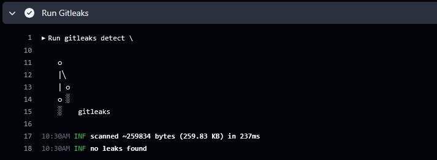

## Dependency Scanning

Dependency scanning is a critical security practice that automatically checks all project dependencies for known vulnerabilities. Our team uses **Snyk** to scan Maven dependencies and identify potential security risks in the codebase. The scanning process is triggered on every workflow call and analyzes the `pom.xml` file to detect vulnerable packages. Results are automatically uploaded to GitHub's security dashboard in SARIF format, providing visibility to the entire development team. We have configured the scan to only block the pipeline on critical severity vulnerabilities, allowing us to prioritize and fix the most important issues first.

The Snyk integration is seamlessly integrated into our CI/CD pipeline through a dedicated workflow that executes the security scan and reports findings. The workflow runs the Snyk CLI against our Maven dependencies, sets a critical severity threshold, and uploads the results to GitHub's native security features. This allows our team to track vulnerabilities over time, receive notifications when new issues are discovered, and maintain a dashboard view of our security posture.

### Workflow Implementation

```yaml
- name: Snyk Dependency Scan
  run: |
    snyk test \
      --org=2324a6a0-65da-44fb-922e-340f88ffea53 \
      --severity-threshold=critical \
      --file=backend/pom.xml \
      --sarif-file-output=snyk.sarif
  env:
    SNYK_TOKEN: ${{ secrets.SNYK_TOKEN }}

- name: Upload Dependency Results
  if: always()
  uses: github/codeql-action/upload-sarif@v3
  with:
    sarif_file: snyk.sarif
```

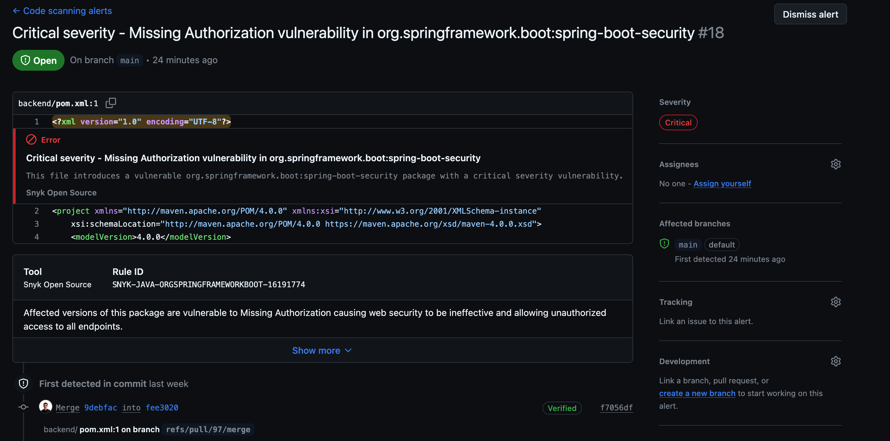

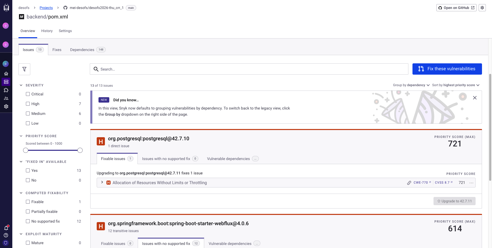

## SAST

Static Application Security Testing (SAST) is a critical security practice that analyzes source code to identify potential security vulnerabilities and code quality issues before deployment. Our team uses SonarCloud to perform comprehensive SAST scans on the codebase. The scanning process analyzes the source code for common vulnerabilities, code smells, and security hotspots, providing detailed reports and recommendations for remediation.

The SonarCloud integration is seamlessly integrated into our CI/CD pipeline through a dedicated reusable workflow that executes code analysis and reports findings using the Maven Sonar plugin. The workflow implements a branch-specific strategy: main and dev branches run with quality gates enabled (`continue-on-error: true` to allow progression during current project phase where 80% coverage is not yet guaranteed), while feature branches run analysis without quality gate enforcement to enable rapid development feedback. The Maven plugin automatically detects project dependencies and binaries, ensuring accurate code analysis without manual library path configuration

### Workflow Implementation

```yaml
name: security-sast.yml
on:
  workflow_call:
    secrets:
      SONAR_TOKEN:
        required: true

jobs:
  sonar:
    name: SonarQube SAST Scan
    runs-on: ubuntu-latest

    steps:
      - name: Checkout code
        uses: actions/checkout@v4
        with:
          fetch-depth: 0

      - name: Set up JDK 17
        uses: actions/setup-java@v4
        with:
          java-version: "17"
          distribution: "temurin"
          cache: maven

      - name: Cache SonarCloud packages
        uses: actions/cache@v4
        with:
          path: ~/.sonar/cache
          key: ${{ runner.os }}-sonar
          restore-keys: ${{ runner.os }}-sonar

      - name: Build project (skip tests)
        working-directory: backend
        run: mvn clean verify -DskipTests

      - name: Download coverage artifact
        uses: actions/download-artifact@v4
        with:
          name: jacoco-report
          path: backend/target/site/jacoco

      - name: SonarCloud Scan (main/dev with Quality Gate)
        continue-on-error: true
        if: |
          github.ref == 'refs/heads/main' ||
          github.ref == 'refs/heads/dev' ||
          github.base_ref == 'main' ||
          github.base_ref == 'dev'
        working-directory: backend
        run: |
          mvn sonar:sonar \
            -Dsonar.projectKey=techstore-backend-key_techstore \
            -Dsonar.organization=techstore-backend-key \
            -Dsonar.host.url=https://sonarcloud.io \
            -Dsonar.token=${{ secrets.SONAR_TOKEN }} \
            -Dsonar.qualitygate.wait=true
        env:
          SONAR_TOKEN: ${{ secrets.SONAR_TOKEN }}

      - name: SonarCloud Scan (feature branches)
        if: |
          github.ref != 'refs/heads/main' && 
          github.ref != 'refs/heads/dev' &&
          github.base_ref != 'main' &&
          github.base_ref != 'dev'
        working-directory: backend
        run: |
          mvn sonar:sonar \
            -Dsonar.projectKey=techstore-backend-key_techstore \
            -Dsonar.organization=techstore-backend-key \
            -Dsonar.host.url=https://sonarcloud.io \
            -Dsonar.token=${{ secrets.SONAR_TOKEN }}
        env:
          SONAR_TOKEN: ${{ secrets.SONAR_TOKEN }}
```

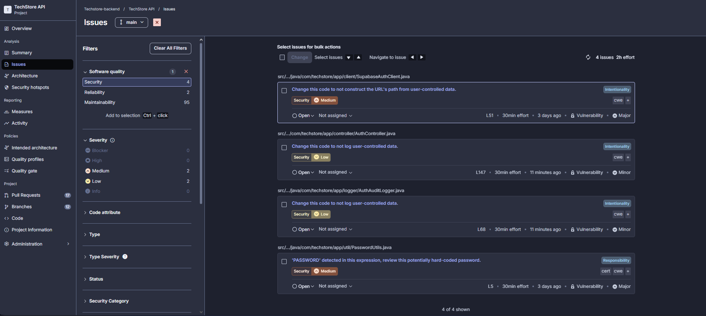
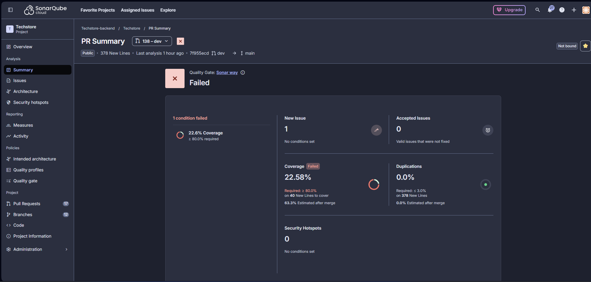

## DAST

Dynamic Application Security Testing (DAST) is a security testing methodology that analyzes a running application for vulnerabilities by simulating external attacks. Unlike SAST, which inspects static source code, DAST interacts with the application from the outside, identifying security flaws that are only discoverable at runtime. Our team uses the **OWASP Zed Attack Proxy (ZAP)** API scan to perform DAST on our application.

The ZAP API scan is integrated into our CI/CD pipeline through a dedicated reusable workflow that executes dynamic analysis on the live application. The workflow implements a risk-based strategy: it sets up a complete testing environment with PostgreSQL database, builds and runs the Java application, and then executes the ZAP scan against the live application's OpenAPI specification. The pipeline only blocks on **CRITICAL** severity vulnerabilities, while high and medium issues are recorded and reported via PR comments to enable tracking and prioritization. The workflow integrates with GitHub's native security features, uploading results in both HTML and XML formats for comprehensive analysis and team visibility.

### Workflow Implementation

```yaml
name: DAST Scan (OWASP ZAP)

on:
  workflow_call:

jobs:
  dast-scan:
    runs-on: ubuntu-latest
    timeout-minutes: 30

    services:
      postgres:
        image: postgres:17
        env:
          POSTGRES_USER: techstore
          POSTGRES_PASSWORD: techstore
          POSTGRES_DB: techstore
        options: >-
          --health-cmd pg_isready
          --health-interval 10s
          --health-timeout 5s
          --health-retries 5
        ports:
          - 5432:5432

    steps:
      - name: Checkout code
        uses: actions/checkout@v4

      - name: Set up Java
        uses: actions/setup-java@v4
        with:
          distribution: temurin
          java-version: "17"
          cache: maven

      - name: Build application
        working-directory: backend
        run: mvn clean package -DskipTests -q

      - name: Start application
        working-directory: backend
        env:
          DB_URL: jdbc:postgresql://localhost:5432/techstore
          POSTGRES_USER: techstore
          POSTGRES_PASSWORD: techstore
          POSTGRES_DB: techstore
        run: |
          JAR_FILE=$(find target -name "*.jar" -type f | head -1)
          java -jar "$JAR_FILE" > /tmp/app.log 2>&1 &
          echo $! > /tmp/app.pid
          sleep 2

      - name: Wait for application ready
        run: |
          for i in {1..60}; do
            if curl -s -f http://localhost:8081/api/actuator/health >/dev/null 2>&1; then
              exit 0
            fi
            sleep 1
          done
          exit 1

      - name: Run OWASP ZAP scan
        run: |
          mkdir -p /tmp/dast-reports
          chmod 777 /tmp/dast-reports
          docker run --rm \
            -v ${{ github.workspace }}/.github/workflows/dast:/zap/custom:ro \
            -v /tmp/dast-reports:/zap/wrk \
            --add-host="host.docker.internal:host-gateway" \
            --user root \
            zaproxy/zap-stable \
            zap-api-scan.py \
              -t http://host.docker.internal:8081/api/v3/api-docs \
              -f openapi \
              -S \
              -r /zap/wrk/zap-report.html \
              -x /zap/wrk/zap-report.xml \
              -c /zap/custom/zap-policy.yaml || true

      - name: Upload HTML report
        if: always()
        uses: actions/upload-artifact@v4
        with:
          name: zap-html-report
          path: /tmp/dast-reports/zap-report.html

      - name: Upload XML report
        if: always()
        uses: actions/upload-artifact@v4
        with:
          name: zap-xml-report
          path: /tmp/dast-reports/zap-report.xml

      - name: Parse vulnerability results
        if: always()
        id: results
        run: |
          CRITICAL=$(grep -o '<riskcode>3</riskcode>' /tmp/dast-reports/zap-report.xml | wc -l)
          HIGH=$(grep -o '<riskcode>2</riskcode>' /tmp/dast-reports/zap-report.xml | wc -l)
          MEDIUM=$(grep -o '<riskcode>1</riskcode>' /tmp/dast-reports/zap-report.xml | wc -l)

          echo "critical=$CRITICAL" >> $GITHUB_OUTPUT
          echo "high=$HIGH" >> $GITHUB_OUTPUT
          echo "medium=$MEDIUM" >> $GITHUB_OUTPUT

          if [ "$CRITICAL" -gt 0 ]; then
            echo "result=failed" >> $GITHUB_OUTPUT
          else
            echo "result=passed" >> $GITHUB_OUTPUT
          fi

      - name: Comment PR with results
        if: always() && github.event_name == 'pull_request'
        uses: actions/github-script@v7
        with:
          script: |
            const critical = parseInt('${{ steps.results.outputs.critical }}') || 0;
            const high = parseInt('${{ steps.results.outputs.high }}') || 0;
            const medium = parseInt('${{ steps.results.outputs.medium }}') || 0;

            let emoji = '✅';
            let status = 'PASSED';
            if (critical > 0) {
              emoji = '🚨';
              status = 'FAILED';
            } else if (high > 0 || medium > 0) {
              emoji = '⚠️';
              status = 'WARNINGS';
            }

            const body = `## ${emoji} DAST Security Scan: ${status}

            | Severity | Count |
            |----------|-------|
            | Critical | ${critical} |
            | High | ${high} |
            | Medium | ${medium} |

            View the full report in [Artifacts](https://github.com/${{ github.repository }}/actions/runs/${{ github.run_id }}).
            `;

            github.rest.issues.createComment({
              issue_number: context.issue.number,
              owner: context.repo.owner,
              repo: context.repo.repo,
              body: body
            });

      - name: Fail if vulnerabilities found
        if: steps.results.outputs.result == 'failed'
        run: exit 1
```

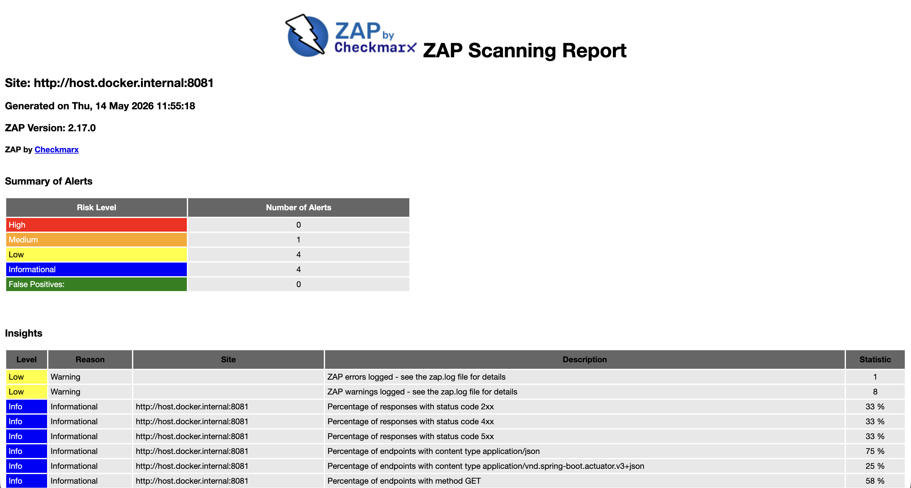

## Container Security

Container security scanning is a critical practice that ensures Docker images are free from known vulnerabilities before being deployed to production. Our team uses **Snyk** to scan container images and identify potential security risks at the OS and dependency layer level. The scanning process is triggered on every workflow call and analyzes the specific image built for that commit, identified by the short commit SHA tag (`sha-{commit-hash}`). Results are automatically uploaded to GitHub's security dashboard in SARIF format, maintaining a centralized view of our security posture across both dependency and container layers. Similarly to dependency scanning, we have configured the scan to only block the pipeline on critical severity vulnerabilities.

The container security integration pulls the image from DockerHub after it has been built and pushed by the Docker publishing workflow, ensuring we scan the exact artifact that will be deployed. This guarantees that the image analysis reflects the final state of the container, including the base OS layers and all installed packages.

### Workflow Implementation

```yaml
name: Container Security Scan

on:
  workflow_call:
  workflow_dispatch:

jobs:
  container-security:
    name: Container Security Scan
    runs-on: ubuntu-latest

    permissions:
      security-events: write
      contents: read

    steps:
      - name: Checkout
        uses: actions/checkout@v4

      - name: Install Snyk CLI
        run: npm install -g snyk

      - name: Pull image from registry
        run: |
          docker pull diogomartins00/techstore:sha-${GITHUB_SHA::7}

      - name: Run Snyk Container Scan
        run: |
          snyk container test diogomartins00/techstore:sha-${GITHUB_SHA::7} \
            --severity-threshold=critical \
            --sarif-file-output=snyk-container.sarif
        env:
          SNYK_TOKEN: ${{ secrets.SNYK_TOKEN }}

      - name: Upload Container Results
        if: always()
        uses: github/codeql-action/upload-sarif@v3
        with:
          sarif_file: snyk-container.sarif
```

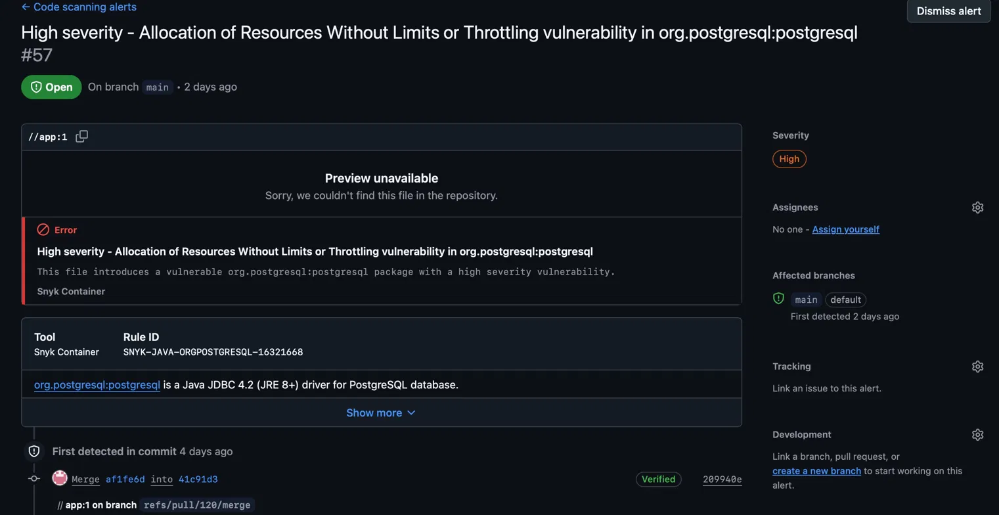

## Docker Image Publishing

Docker image publishing is a critical part of our deployment pipeline that automates the building and pushing of Docker images to DockerHub. This ensures that every release and main branch deployment has a corresponding container image available for deployment. Our workflow is triggered automatically on git version tags (e.g., `v1.0.0`) and can also be manually invoked. The Docker build process uses the `backend/` directory and `backend/Dockerfile` as the build context, and we build for multiple architectures including both `linux/amd64` and `linux/arm64` to support various deployment environments.

The tagging strategy is intelligent and automated, allowing us to tag images in multiple ways depending on the trigger context. Every build receives a commit SHA tag (`sha-{commit-hash}`), release tags are applied when pushing version tags, and the special `latest` tag is applied to images built from the main branch. Our workflow leverages Docker Buildx for multi-platform builds and GitHub Actions cache for improved build performance. All credentials are securely stored in GitHub Secrets, and the workflow is reusable, allowing it to be called from other workflows in our pipeline.

### Workflow Implementation

```yaml
- name: Set up Docker Buildx
  uses: docker/setup-buildx-action@v3

- name: Login to DockerHub
  uses: docker/login-action@v3
  with:
    username: ${{ secrets.DOCKERHUB_USERNAME }}
    password: ${{ secrets.DOCKERHUB_TOKEN }}

- name: Build and push Docker image
  uses: docker/build-push-action@v5
  with:
    context: backend
    file: backend/Dockerfile
    platforms: linux/amd64,linux/arm64
    push: true
    tags: ${{ steps.meta.outputs.tags }}
    cache-from: type=gha
    cache-to: type=gha,mode=max
```

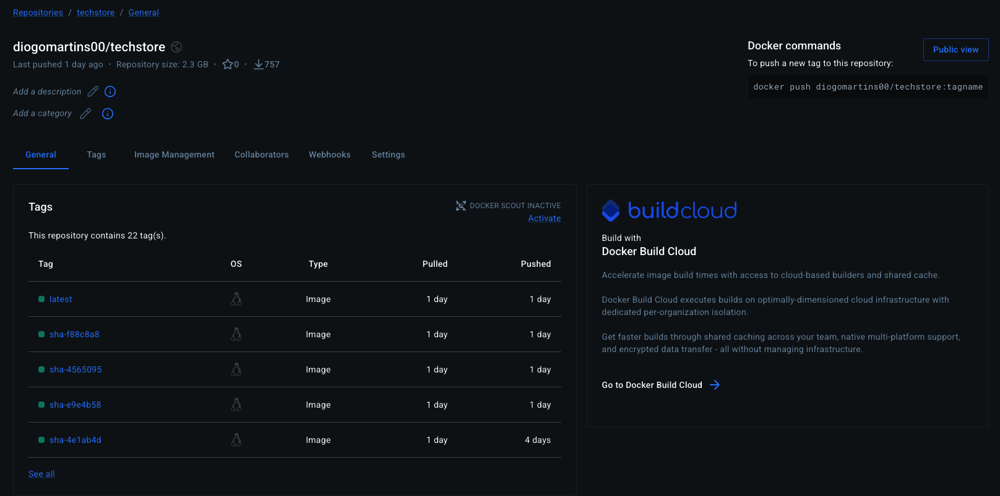

## Deployment

Deployment to production occurs when changes are ready on the main branch. The deployment process is fully automated through a secure SSH connection to the production server, where it pulls the latest Docker image and starts containers with proper configuration. Our deployment workflow handles all the necessary steps including system cleanup to remove unused Docker images and containers, authentication to DockerHub, and network setup to ensure the backend container runs in an isolated network. The process creates a `techstore-net` Docker network if it doesn't already exist, maintaining security through network isolation while ensuring seamless communication between services.

The deployment process carefully removes old containers before starting new ones. The backend container is configured with the `restart unless-stopped` policy to ensure it automatically recovers from unexpected crashes, and it runs with environment configuration loaded from `/opt/techstore/backend.env`. All sensitive credentials including SSH keys, DockerHub tokens, and server details are securely stored in GitHub Secrets, ensuring that production credentials are never exposed in the workflow code.

### Workflow Implementation

```yaml
- name: Deploy via SSH
  uses: appleboy/ssh-action@v1.0.3
  with:
    host: ${{ secrets.SSH_HOST }}
    port: 22
    username: ${{ secrets.SSH_USER }}
    key: ${{ secrets.SSH_KEY }}
    script: |
      set -e

      sudo docker system prune -af
      echo "${{ secrets.DOCKERHUB_TOKEN }}" | sudo docker login -u "${{ secrets.DOCKERHUB_USERNAME }}" --password-stdin
      sudo docker network inspect techstore-net >/dev/null 2>&1 || sudo docker network create techstore-net

      BACKEND_IMAGE="${{ secrets.DOCKERHUB_USERNAME }}/techstore:latest"
      sudo docker pull "$BACKEND_IMAGE"

- name: Start containers
  uses: appleboy/ssh-action@v1.0.3
  with:
    host: ${{ secrets.SSH_HOST }}
    port: 22
    username: ${{ secrets.SSH_USER }}
    key: ${{ secrets.SSH_KEY }}
    script: |
      set -e

      BACKEND_IMAGE="${{ secrets.DOCKERHUB_USERNAME }}/techstore:latest"

      sudo docker rm -f techstore || true
      sudo docker run -d \
        --name techstore \
        --restart unless-stopped \
        --network techstore-net \
        -p 8080:8081 \
        --env-file /opt/techstore/backend.env \
        "$BACKEND_IMAGE"

      sudo docker image prune -f
```

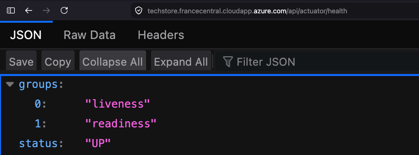

## Release Please

Release Please automates the release management process by tracking changes through conventional commit messages and generating versioned releases automatically. Our team uses the **Release Please** GitHub Action to streamline the creation of changelogs and version bumps, eliminating manual overhead in the release process. The workflow is triggered both on pipeline calls from the main branch workflow and manually via `workflow_dispatch`, ensuring releases can be issued automatically on every merge to `main` or on demand when needed.

When changes are pushed to `main`, Release Please analyzes the accumulated commits since the last release, generates or updates a release pull request with a structured changelog, and automatically bumps the version following semantic versioning. Once the release PR is approved and merged, Release Please creates the corresponding GitHub release. This integrates directly with our tagging strategy used by the Docker image publishing workflow, ensuring that every GitHub release triggers a properly versioned container image build.

### Workflow Implementation

```yaml
name: Release Please

on:
  workflow_call:

  workflow_dispatch:

permissions:
  contents: write
  pull-requests: write

jobs:
  release:
    runs-on: ubuntu-latest

    steps:
      - uses: googleapis/release-please-action@v4
        with:
          token: ${{ secrets.GITHUB_TOKEN }}
          release-type: simple
```

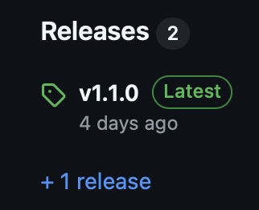
