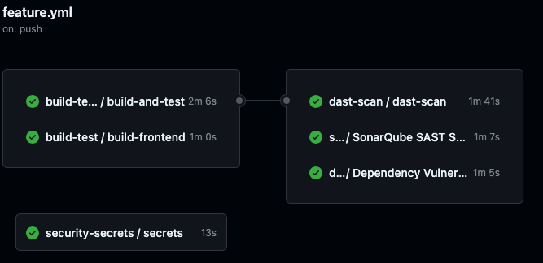
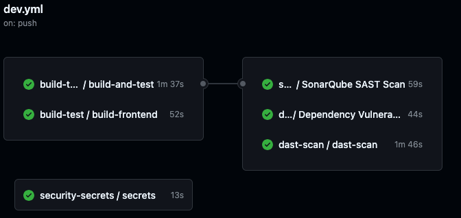
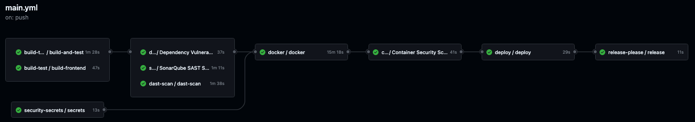
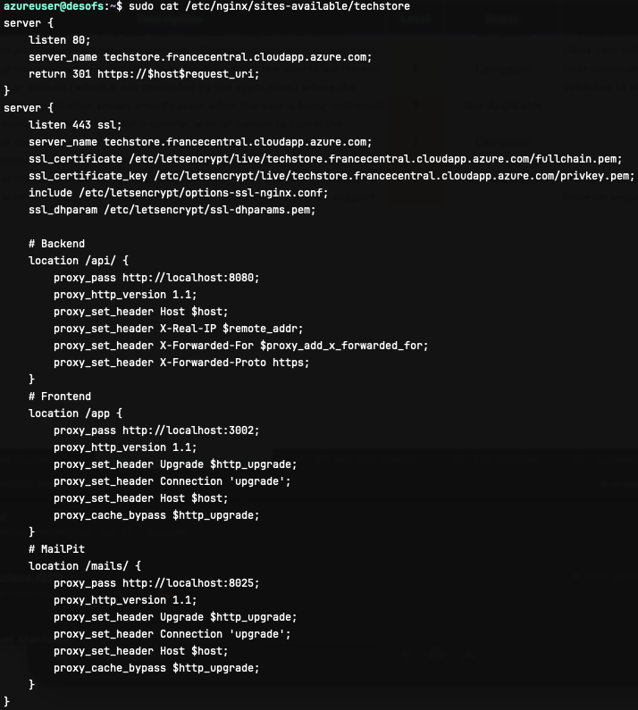
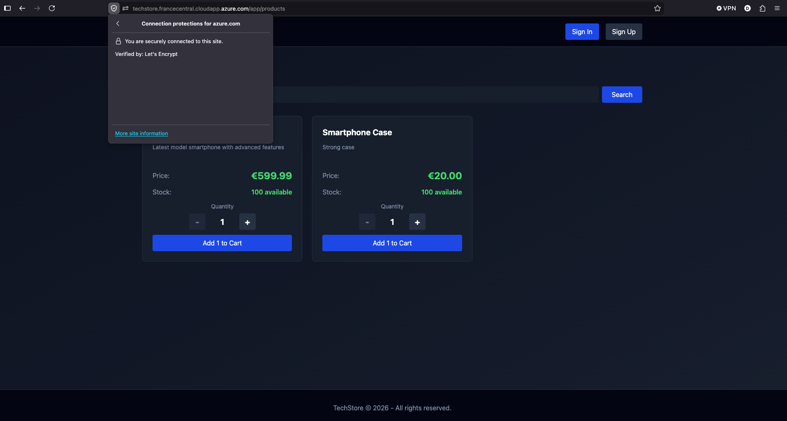

# Project - Phase 3

| Name             | Student Number |
| ---------------- | -------------: |
| Diogo Martins    |        1221223 |
| Francisco Osorio |        1220846 |
| Joao Pinto       |        1220663 |
| Francisco Reis   |        1201373 |
| Marco Marques    |        1250685 |

# Introduction

In this report, its presentend the phase 3 of the DESOFS project, which consists in the development of the software, following the best practices and security measures defined in the previous phases. The main goal of this phase is to implement the software according to the requirements and design defined in the previous phases, while ensuring that the code is maintainable, scalable and secure.

# Project Overview

**TechStore** consists of the development of a secure e-commerce platform designed to support online product sales, order management, and delivery operations. The system provides a set of RESTful services and a web-based user interface, enabling customers, managers, and carriers to interact with the platform according to their assigned roles.

Additionally, the system provides administrative functionalities that allow managers to maintain product catalogs, manage categories, monitor orders, and oversee platform operations.

## Key Features

- User Management: Handling user registration, authentication, account verification, password recovery, and role-based access control for customers, managers, and carriers.
- Product Management: Allowing managers to create, update, and remove products and categories while providing customers with access to product information and availability.
- Shopping Cart Management: Enabling customers to manage cart contents before completing purchases.
- Order Management: Supporting order creation, tracking, and status management throughout the purchase lifecycle.
- Delivery Operations: Allowing carriers to view assigned deliveries, manage order pickups, and update delivery-related information.
- Administrative Functions: Providing managers with access to operational functionality, system monitoring capabilities, and business-related management features.
- Security Controls: Implementing secure authentication, authorization, HTTPS communication, restricted CORS policies, Content Security Policy (CSP), and additional browser security protections aligned with industry best practices.

The system architecture consists of a Next.js web frontend, a Spring Boot REST API backend, and a relational database for persistent data storage. An NGINX reverse proxy is used to route traffic and enforce secure communication. The application is designed to be scalable, maintainable, and secure while providing a reliable online shopping experience for all user roles.

# Full Workflow

# Requirements Implemented

## Functional Requirements

| ID  | Requirement | Status |
|-----|-------------|--------|
| FR1 | Allow anonymous users to register as a customer | Done |
| FR2 | Allow users to log in and log out | Done |
| FR3 | Provide password recovery functionality | Done |
| FR4 | Allow authenticated users to refresh JWT tokens before expiration | Done |
| FR5 | Allow managers to invite new users (managers or carriers) | Done |
| FR6 | Allow invited users to complete registration | Done |
| FR7 | Display a list of available products | Done |
| FR8 | Allow users to search products by name | Done |
| FR9 | Display product details (price, description, stock) | Done |
| FR10 | Allow customers to add products to the cart | Done |
| FR11 | Allow customers to remove products from the cart | Done |
| FR12 | Allow customers to update product quantities in the cart | Not Done |
| FR13 | Automatically calculate cart totals | Done |
| FR14 | Allow customers to place orders | Done |
| FR15 | Validate product stock before confirming orders | Done |
| FR16 | Store user order history | Done |
| FR17 | Allow customers to view order status | Done |
| FR18 | Send order confirmation emails | Done |
| FR19 | Allow carriers to view orders ready for pickup | Done |
| FR20 | Display relevant order information for pickup | Done |
| FR21 | Allow carriers to mark an order as picked up | Done |
| FR22 | Allow managers to add new products | Done |
| FR23 | Allow managers to edit product information | Not Done |
| FR24 | Allow managers to manage product categories | Done |
| FR25 | Allow managers to update product stock levels manually | Not Done |
| FR26 | Allow managers to view and filter all customer orders | Not Done |
| FR27 | Allow managers to create backups of products, categories, and orders | Partially Done |

---

## Non-Functional Requirements

| ID   | Requirement | Status |
|------|-------------|--------|
| NFR1 | API must be accessible only via HTTPS (TLS 1.2+) in non-local environments | Done |
| NFR2 | Passwords must be hashed using a strong adaptive algorithm (e.g., BCrypt) | Done |
| NFR3 | System must enforce RBAC with deny-by-default authorization | Done |
| NFR4 | System must mitigate common web vulnerabilities (SQLi, XSS, CSRF where applicable) | Done |
| NFR5 | Security-relevant actions must be logged with timestamp and user context | Done |
| NFR6 | Two-factor authentication is mandatory for all users | Partially Done |
| NFR7 | System must handle at least 100 concurrent requests with <500ms response time | Done |
| NFR8 | Codebase must follow clean architecture principles | Done |
| NFR9 | CI/CD must run automated build, tests, and security checks | Done |
| NFR10 | Application must be containerized with non-root execution | Done |
| NFR11 | API must follow REST conventions with consistent error handling | Done |
| NFR12 | OpenAPI documentation must be maintained for all endpoints | Done |
| NFR13 | Dependency scanning must block critical vulnerabilities | Done |
| NFR14 | Automated tests must ensure ≥80% coverage in core layers | Partially Done |
| NFR15 | Secrets must not be stored in source code; secret scanning enabled | Done |

---

## Security Requirements

| ID  | Requirement | Status |
|-----|-------------|--------|
| SR1 | Multi-Factor Authentication (MFA) required for authentication | Done |
| SR2 | Lock accounts after 5 failed login attempts with cooldown | Not Done |
| SR3 | Passwords must be at least 12 characters long | Done |
| SR4 | Send email confirmation after registration | Done |
| SR5 | Role-Based Access Control (RBAC) must be enforced | Done |
| SR6 | Sessions expire after inactivity | Done |
| SR7 | Rate limiting must be implemented on entry endpoints | Done |
| SR8 | Sensitive data must be encrypted in transit and at rest | Done |
| SR9 | Passwords must be hashed with bcrypt or equivalent | Done |
| SR10 | GDPR compliance for personal data handling | Not Done |
| SR11 | Input validation must prevent SQL injection and XSS | Done |
| SR12 | Validate all user-submitted data formats | Done |
| SR13 | Validate transactional consistency (orders, stock, totals) | Done |
| SR14 | Secure storage of sensitive logs | Done |
| SR15 | Logs must be backed up in 3 locations (local + 2 cloud) | Done |

# Production

# Security Requirements and Tests Traceability

| Security Requirement | Test |
|----------------------|------|
| SR1 MFA | |
| SR2 Lockout | |
| SR3 Password policy | |
| SR4 Registration email | |
| SR5 RBAC | |
| SR6 Session Expiry | |
| SR7 Rate limiting | |
| SR8 Encryption at rest and in transit | |
| SR9 Password hashing | |
| SR10 GDPR compliance | |
| SR11 Input validation | |
| SR12 Data format validation | |
| SR13 Secure logs | |
| SR14 Log backup | |