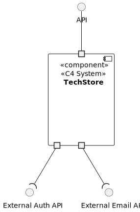
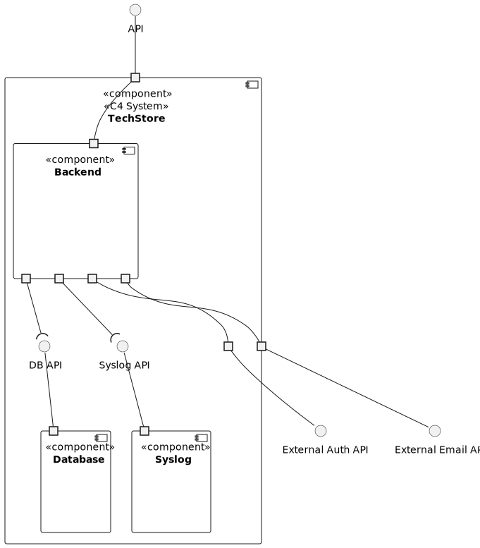
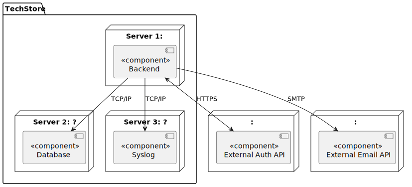
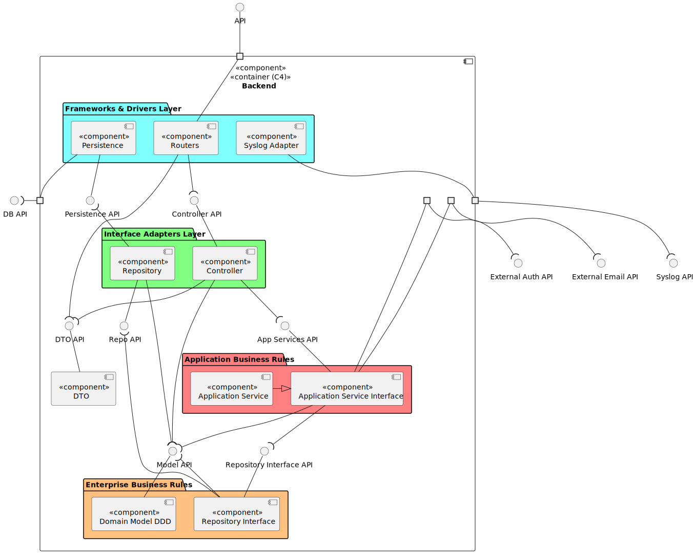

### Secure architecture 

The architecture is designed to minimize attack surfaces, enforce separation of concerns, and facilitate secure development practices.
To represent the architecture of our system, we use C4 diagrams at different levels of abstraction, following the C4 model for software architecture.

**Level 1 - Logical View**:

**Level 2 - Logical View**:

**Level 2 - Deployment View**:

**Level 3 - Logical View**:

As illustrated in the level 3 logical view, our system is designed with a layered architecture that promotes separation of concerns and encapsulation of business logic. The layers are organized as follows:

- **Enterprise Business Rules Layer**
  - Represents the core of the system and contains the domain entities and fundamental business rules.  
  - This layer models real-world concepts and behaviors specific to the problem domain.
  - It is independent of any external systems, frameworks, or technologies, ensuring that the core business logic remains unaffected by changes in the outer layers.
  - This isolation ensures that vulnerabilities in outer layers cannot directly compromise the core business logic.

- **Application Business Rules Layer**
  - Encapsulates the application-specific business logic and use cases.
  - This layer coordinates operations between entities and repository interfaces, enforcing the business rules of the application.  
  - It depends only on the Enterprise Business Rules layer and defines interfaces for interactions with external systems, while remaining isolated from implementation details.
  - Centralizing business logic here ensures that security rules such as access control and role validation are applied consistently across all use cases.

- **Interface Adapters Layer**
  - Acts as a bridge between the outer and inner layers
  - It adapts data to and from the format required by the application and domain layers.
  - This layer houses controllers, request validation, and authentication enforcement, making it the primary security boundary where unauthorized or malicious requests are rejected before reaching the business logic.

- **Frameworks & Drivers Layer**
  - The outermost layer that interacts with frameworks, external systems, and infrastructure.
  - This layer depends on the inner layers but is never depended upon by them, allowing the system to replace or modify technologies without impacting business logic.
  - Isolating external dependencies here limits the blast radius of third-party vulnerabilities, ensuring a compromise at this level does not directly expose core business logic.