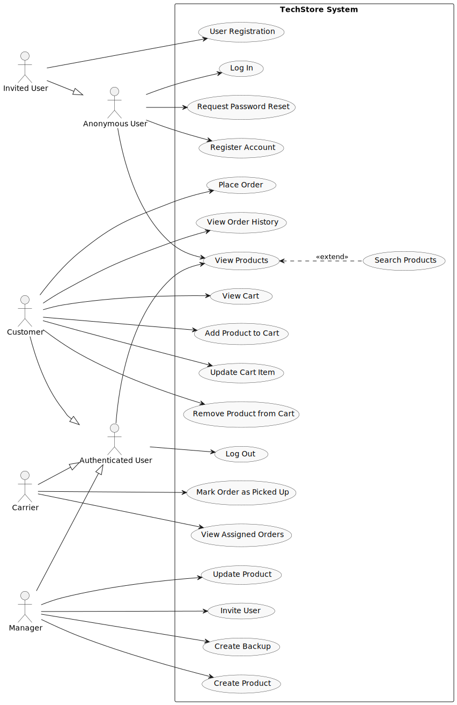
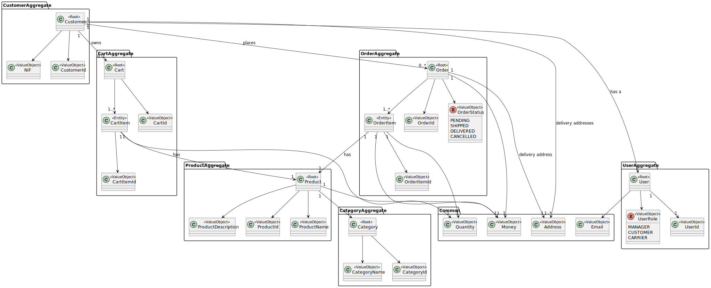
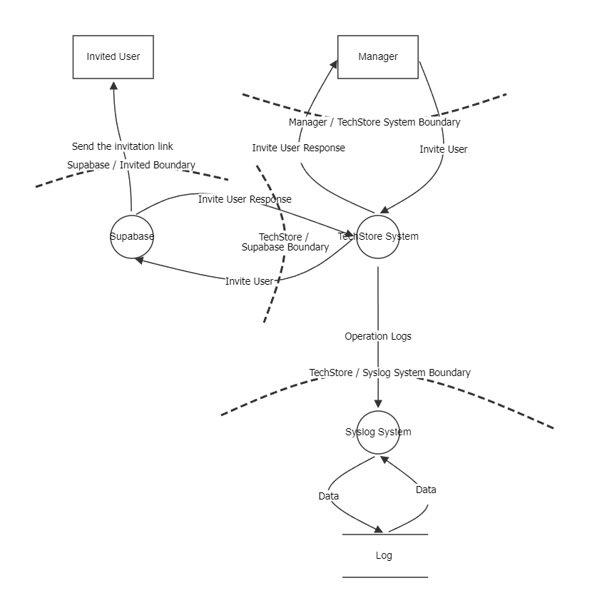
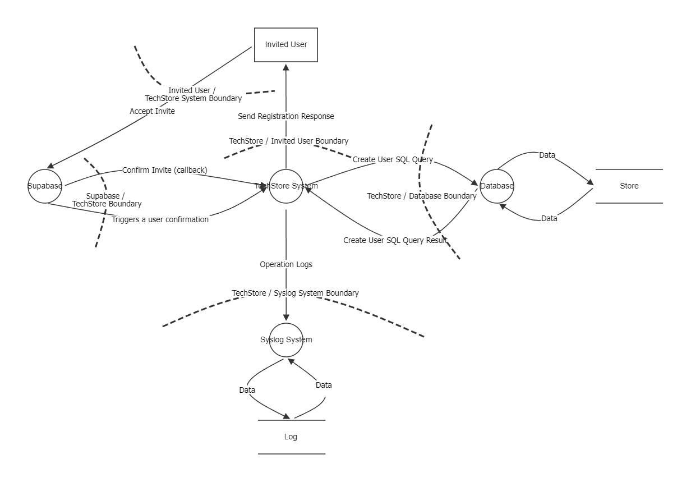
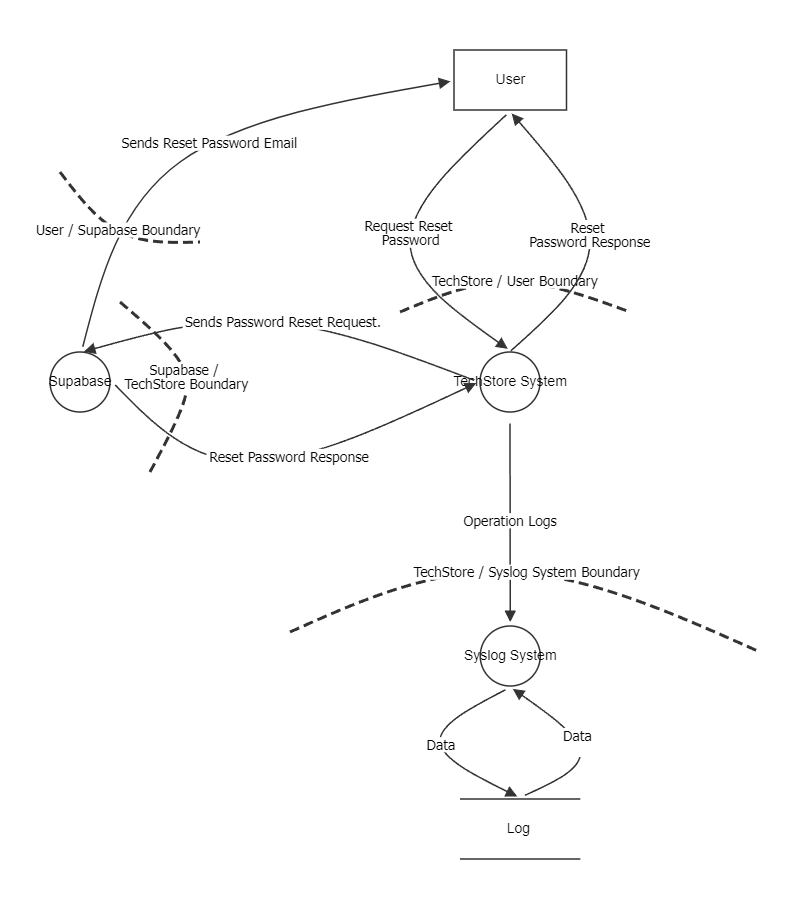
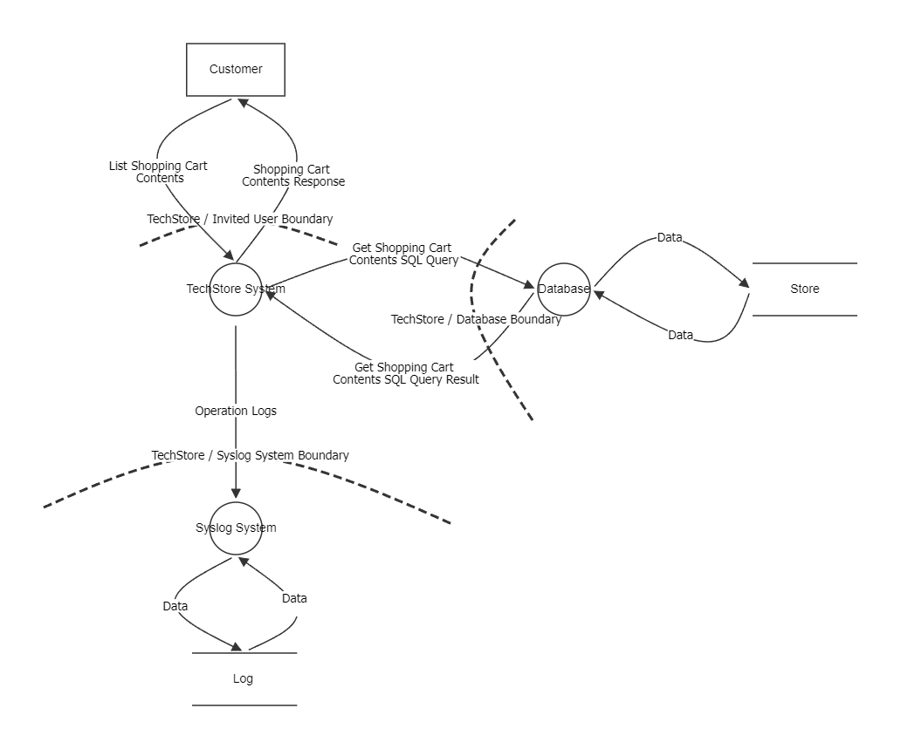
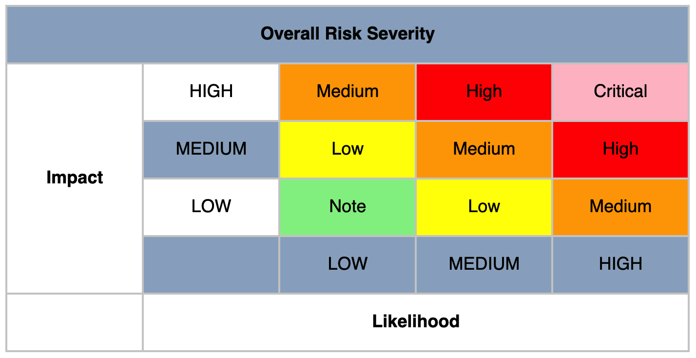
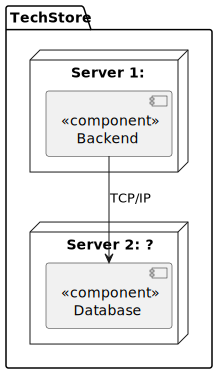

# Desenvolvimento de Software Seguro

## Project - Phase 1

| Name | Student Number |
| --- | ---: |
| Diogo Martins | 1221223 |
| Francisco Osorio | 1220846 |
| Joao Pinto | 1220663 |
| Francisco Reis | 1201373 |
| Marco Marques | 1250685 |

# Introduction

In this report, its presentend the phase 1 of the DESOFS project, which consists in documenting operations related to SSDLS Analysis and Design. The project is focused on the development of a E-commerce Restful API focused on sellig technology products, such as computers, smartphones, electonics and more.

The main topics covered in this report includes functional and non-functional requirements, security requirements, use cases, domain model,
threat modelling, secure design, secure archtecture and security test plan.

# Analysis

## Functional Requirements

| ID | Requirement |
|----|-------------|
| **FR1** | The system shall allow anonymous users to register as a customer. |
| **FR2** | The system shall allow users to log in and log out. |
| **FR3** | The system shall provide password recovery functionality. |
| **FR4** | The system shall allow authenticated users to refresh their JWT token before expiration. |
| **FR5** | The manager user shall be able to invite new users (managers or carriers) to the system. |
| **FR6** | The system shall allow invited users to complete their registration process. |
| **FR7** | The system shall display a list of available products. |
| **FR8** | The system shall allow users to search for products by name. |
| **FR9** | The system shall display product details (price, description, stock). |
| **FR10** | The customer shall be able to add products to the cart. |
| **FR11** | The customer shall be able to remove products from the cart. |
| **FR12** | The customer shall be able to update product quantities from the Cart. |
| **FR13** | The system shall automatically calculate the cart total. |
| **FR14** | The customer shall be able to place an order from the cart. |
| **FR15** | The system shall validate product stock before confirming the order. |
| **FR16** | The system shall store the user's order history. |
| **FR17** | The customer shall be able to view the order status. |
| **FR18** | The system shall send an order confirmation email to the user. |
| **FR19** | The carrier user shall view a list of orders ready for pickup. |
| **FR20** | The carrier user shall display relevant order information for pickup. |
| **FR21** | The carrier user shall mark an order as picked up. |
| **FR22** | The manager user shall be able to add new products. |
| **FR23** | The manager user shall be able to edit existing product information. |
| **FR24** | The manager user shall be able to manage product categories. |
| **FR25** | The manager user shall be able to update product stock levels manually. |
| **FR26** | The manager user shall be able to view and filter all customer orders in the backoffice. |
| **FR27** | The manager user shall be able to create a backup of products, categories, and orders data. |

## Non-Functional Requirements

| ID        | Requirement                                                                                                                                               |
|-----------|-----------------------------------------------------------------------------------------------------------------------------------------------------------|
| **NFR1**  | The API must be available only through HTTPS (TLS 1.2 or higher) in non-local environments.                                                               |
| **NFR2**  | User passwords must be hashed with a strong adaptive algorithm (e.g., BCrypt) before persistence.                                                         |
| **NFR3**  | The system must enforce role-based access control (RBAC) with deny-by-default authorization.                                                              |
| **NFR4**  | The API must mitigate common web threats (SQL Injection, XSS, CSRF where applicable) through input validation, parameterized queries, and secure headers. |
| **NFR5**  | Security-relevant actions (authentication, authorization failures, and critical data changes) must be logged with timestamp and user context.             |
| **NFR6**  | Two-factor authentication is mandatory to all users.                                                                                                      |
| **NFR7**  | The system must handle at least 100 concurrent requests with response time below 500 ms.                                                                  |
| **NFR8**  | The codebase must follow clean architecture principles.                                                                                                   |
| **NFR9**  | CI/CD pipelines must run automatically on pull requests and include build, tests, and security checks before merge.                                       |
| **NFR10** | The application must be deployable as containers using non-root execution and minimal runtime image principles (preferably with Docker Hardened images).  |
| **NFR11** | The API must follow REST conventions, returning correct HTTP status codes and consistent structured error responses.                                      |
| **NFR12** | The API must provide and maintain OpenAPI documentation for all public endpoints, inputs, outputs, and error cases.                                       |
| **NFR13** | Dependency vulnerability scanning (SCA) must run in CI, with no Critical vulnerabilities allowed in release builds.                                       |
| **NFR14** | Automated tests must ensure minimum 80% line coverage in service/domain layers and include security-related test cases.                                   |
| **NFR15** | Secrets (keys, tokens, passwords) must not be stored in source code; secret scanning must be enabled in the repository.                                   |

## Security Requirements

### Authentication and Access Control
- **SR1.** The user authentication must implement Multi-Factor Authentication (MFA) to enhance security.

- **SR2.** The system must lock user accounts after 5 consecutive failed login attempts to prevent brute-force attacks, requiring the user to wait a defined cooldown period before attempting to log in again.

- **SR3.** The password must contain at least 12 characters, including uppercase letters, lowercase letters, numbers, and special characters.

- **SR4.** The system must send a confirmation email after a successful registration to verify the user identity.

- **SR5.** The system must use role-based access control (RBAC) to restrict access to sensitive features based on user roles.

- **SR6.** Authenticated sessions should automatically expire after a period of inactivity.

- **SR7.** The system must implement a rate limiting mechanism to prevent abuse of entry endpoints.

### Data Protection

- **SR8.** All sensitive data must be encrypted, both at rest and in transit, ensuring secure communication and storage.

- **SR9.** Passwords must be hashed using strong algorithms (e.g., bcrypt) before being stored in the database.

- **SR10.** Collected personal data must be handled in compliance with relevant GDPR regulations, being used only for specified purposes and not retained longer than necessary.

### Input Validation and Error Handling

- **SR11.** The system must validate all user inputs to prevent common vulnerabilities such as SQL injection and cross-site scripting (XSS).

- **SR12.** The system must validate the user-submitted data, rejecting any input that does not conform to expected formats.

### Logging and Monitoring

- **SR13.** All logs of sensitive actions must be securely stored and protected against unauthorized access to ensure integrity and confidentiality.

- **SR14.** All logs must perform three backup copies, one stored locally and another two stored in a secure cloud storage service, to ensure data durability and availability in case of local failures.

## Use Cases

## Domain Model

# Design

## Threat Modelling

- **Application Name**: TechStore API
- **Application Version**: 1.0.0
- **Description**: The TechStore API is a E-commerce Restful API focused on sellig technology products, such as computers, smartphones, electonics and more. The API support multiple roles, such as customers, managers and carriers. 

  As a customer you can browse products, manage a shopping cart, and place orders. Managers are responsible for managing products, categories, stock levels, viewing orders, and inviting new users (managers or carriers). Carriers handle order pickup and update delivery status. Invited users complete their registration through a invitation process and an anonymous user can also register in the system as a customer, log in , log out, recover your password and browse products.

  The application will be developed using Java with the Spring Boot framework and will use a relational database, PostgreSQL. Furthermore, the application uses external services for authentication and authorization, and email notifications.

- **Document Owner**: Diogo Martins, Francisco Osório, Francisco Reis, João Araújo, Marco Marques
- **Participants**: Diogo Martins, Francisco Osório, Francisco Reis, João Araújo, Marco Marques
- **Reviewers**: Diogo Martins, Francisco Osório, Francisco Reis, João Araújo, Marco Marques 

## External Dependencies

External dependencies are items external to the code of the application that may pose a threat to the application. These items are fundamental for the safe and efficient operation of the API, so it is important to identify and analyze them.

| ID | Description                                                                                                                                                                                                                                                                                                              |
|----|--------------------------------------------------------------------------------------------------------------------------------------------------------------------------------------------------------------------------------------------------------------------------------------------------------------------------|
| 1  | **Supabase Identity Provider** - Handles authentication and RBAC via OAuth 2.0/OIDC. Issues and rotates JWTs used to authenticate every protected API request.                                                                                                                                                           |
| 2  | **PostgreSQL Relational Database** - External managed database used to store and retrieve all business data (products, orders, carts, audit logs). Accessed by the backend via JDBC using authenticated, least-privilege credentials over TLS.                                                                           |
| 3  | **Email Server (SMTP)** - Cloud email delivery service used via Spring Boot Mail Starter to send transactional emails (order confirmations, password recovery, security alerts). Credentials stored as environment secrets and never hardcoded.                                                                          |                                        |
| 4  | **Docker** - Containerizes the backend and supporting services for consistent, isolated deployment across environments.                                                                                                                                                                                                  |
| 5  | **Firewall and Network Security** - Restricts exposed ports to 443 (HTTPS) and filters all other inbound/outbound traffic at the infrastructure level.                                                                                                                                                                   |
| 6  | **HTTPS / TLS Certificates** - Enforces encrypted communication on all API endpoints. Plaintext HTTP is rejected; certificates must be publicly trusted and kept current.                                                                                                                                                |
| 7  | **Syslog Server** - Centralized logging service that aggregates security-relevant events from the backend for auditing, monitoring, and incident response.                                                                                                                                                               |
| 8  | **Backup Storage Services** - Stores encrypted backups of all application data following the 3-2-1 rule: at least three copies, on two separate storage media, with one kept off-site. Backups are performed with a defined frequency and all copies are encrypted at rest to prevent unauthorized access or disclosure. |
| 9  | **Java Runtime Environment (JRE)** - Required to run the backend. Must be kept on an actively maintained version to avoid known runtime vulnerabilities.                                                                                                                                                                 |
| 10 | **Third-party Libraries (SBOM)** - External libraries used in development (e.g., Spring Boot, Spring Security, Hibernate). An SBOM will be maintained and libraries scanned via SCA tooling.                                                                                                                             |
| 11 | **Bucket4j (Rate Limiter)** - Spring Boot-compatible library used to enforce request rate limits on authentication endpoints (login, registration, password recovery), protecting against brute force and credential stuffing attacks.                                                                                   |
| 12 | **Secret Management** - Database passwords, API keys, SMTP credentials, and JWT secrets are injected via environment variables at runtime and never stored in the repository.                                                                                                                                            |
| 13 | **CI/CD Pipeline** (e.g., GitHub Actions) - Automates build, test, and deployment with integrated security gates (SAST, SCA, automated tests) on every code change.                                                                                                                                                      |
| 14 | **SAST / SCA Tools** (e.g., SonarQube, OWASP Dependency-Check) - Identifies vulnerabilities in source code and third-party dependencies; integrated into the CI/CD pipeline.                                                                                                                                             |

## Trust Levels

| ID | Name | Description |
| --- | --- | --- |
| 1 | Anonymous User | A user who has not logged. Can browse the products catalogue and perform products searchs but cannot access any functionality that requires authentication. |
| 2 | Customer | A registered and logged user on the system, can manage their account, buy products, and access all the features available to authenticated users. |
| 3 | Manager | A user with administrative privileges, can manage the system and its resources, activate or deactivate products, update products stock level and information, add new products, invites new carriers and managers. |
| 4 | Carrier | A user responsible for delivering products to customers, can view orders ready to pick up, view order information for pick up, and mark orders as delivered. |
| 5 | Invited User | A user who has been invited to join the system but has not yet accepted the invitation. They have the same access as a anonymous user until they accept the invitation, and then they can become a Manager or Carrier. |

## Entry Points

|ID|Name|Description|Trust Level|
|--|----|-----------|-----------|
|1| HTTPs Port| The API will be only acessible via TLS encrypted HTTPs connections. | Anonymous User, Customer, Carrier, Manager, Invited User |
|2| POST /api/auth/register| The register endpoint allows unregistered users to create a new account as a customer. | Anonymous User |
|3| POST /api/auth/login| The login endpoint allows users to authenticate and obtain a JWT token for subsequent requests. | Anonymous User |
|4| POST /api/auth/logout| The logout endpoint allows authenticated users to invalidate their JWT token and end their session. | Customer, Carrier, Manager |
|5| POST /api/auth/refresh| The refresh endpoint allows authenticated users to obtain a new JWT token before the current one expires. | Customer, Carrier, Manager |
|6| POST /api/auth/invite| The invite endpoint allows managers to invite new users (managers or carriers) to the system. | Manager |
|7| POST /api/auth/confirm-invite| The confirm invite endpoint allows invited users to complete their registration process. | Invited User |
|8| POST /api/auth/reset-password| The reset password endpoint allows users to request a password reset link via email. | Anonymous User |
|9| GET /api/products| The products endpoint allows users to retrieve a list of available products. | Anonymous User, Customer, Carrier, Manager, Invited User |
|10| GET /api/products/search?productName={name}| The products endpoint allows users to search for products by name. | Anonymous User, Customer, Carrier, Manager, Invited User |
|11| POST /api/products| The products endpoint allows managers to create new products. | Manager |
|12| PATCH /api/products/{id}| The products endpoint allows managers to update existing products. | Manager |
|13| GET /api/cart | The cart endpoint allows customers to view the contents of their shopping cart. | Customer |
|14| POST /api/cart/items | The cart endpoint allows customers to add products to their shopping cart. | Customer |
|15| PUT /api/cart/items/{productId} | The cart endpoint allows customers to update the quantity of a product in their shopping cart. | Customer |
|16| DELETE /api/cart/items/{productId} | The cart endpoint allows customers to remove a product from their shopping cart. | Customer |
|17| POST /api/orders | The orders endpoint allows customers to place a new order based on the contents of their shopping cart. | Customer |
|18| GET /api/orders | The orders endpoint allows customers to view their order history. | Customer |
|19| GET /api/carrier/orders | The carrier orders endpoint allows carriers to view the orders assigned to them for delivery. | Carrier |
|20| PATCH /api/carrier/{orderId}/pickup | The carrier orders endpoint allows carriers to update the status of an order to "picked up". | Carrier |
|21| POST /api/manager/backup | The manager backup endpoint allows managers to create a backup of the products, categories, and orders data. | Manager |

## Exit Points

## Assets

| ID | Name | Description | Trust Levels |
|---|---|---|---|
| 1 | Stored Data | Persistent data maintained by the application, including product, category, cart, order, and user-related data. | Customer, Carrier, Manager/Admin |
| 1.1 | User Credentials | Identity and credential data used for authentication and RBAC. Includes account identity and login-related information. | Customer, Carrier, Manager/Admin |
| 1.2 | User Personal Data | Customer and invited-user personal data handled by the system for account and order-related flows. | Customer, Carrier, Manager/Admin |
| 1.3 | Product Data | Product information such as name, description, price, category, and timestamps. | Customer, Carrier, Manager/Admin |
| 1.4 | Category Data | Product category records with unique names and timestamps. | Customer, Carrier, Manager/Admin |
| 1.5 | Cart Data | Shopping cart items, quantities, and computed totals. | Customer |
| 1.6 | Order and Fulfillment Data | Orders, statuses, pickup lifecycle, and order history. | Customer, Carrier, Manager/Admin |
| 1.7 | Reporting Data | Aggregated sales and operational reports used in the backoffice. | Manager/Admin |
| 1.8 | Error and Validation Responses | Error payloads and validation feedback returned by the API. | Customer, Carrier, Manager/Admin |
| 2 | System Services | Services required to operate the platform, including backend, authentication, email, and logging integrations. | Manager/Admin |
| 2.1 | Spring Boot Backend API | Main application service exposing the API endpoints and business logic. | Customer, Carrier, Manager/Admin |
| 2.2 | Authentication Service | External identity provider used for authentication, JWT issuance, and RBAC. | Customer, Carrier, Manager/Admin |
| 2.3 | PostgreSQL Database | Relational database used to store application data. | Manager/Admin |
| 2.4 | Email Service | SMTP service used for registration confirmation, password recovery, and notifications. | Customer, Carrier, Manager/Admin |
| 2.5 | Syslog Server | Centralized logging service used for security-relevant events and auditing. | Manager/Admin |
| 2.6 | API Documentation Service | OpenAPI and Swagger UI endpoints for the backend API. | Customer, Carrier, Manager/Admin |
| 2.7 | Monitoring Endpoints | Actuator health and info endpoints exposed by the backend. | Manager/Admin |
| 3 | Sessions and Tokens | JWTs or session artifacts used to access protected endpoints. | Customer, Carrier, Manager/Admin |
| 4 | Deployment Infrastructure | Runtime and delivery infrastructure used to build, deploy, and host the system. | Manager/Admin |
| 4.1 | Docker Runtime | Containerized backend and supporting services used for deployment. | Manager/Admin |
| 4.2 | Firewall and Network Security | Network controls restricting exposed ports and protecting internal services. | Manager/Admin |
| 4.3 | HTTPS / TLS Certificates | Certificates enforcing encrypted communication on API endpoints. | Manager/Admin |
| 4.4 | CI/CD Pipeline | Automated build, test, and deployment pipeline. | Manager/Admin |
| 4.5 | SAST / SCA Tools | Static analysis and dependency scanning tools integrated into the pipeline. | Manager/Admin |
| 4.6 | Java Runtime Environment | Runtime required to execute the backend application. | Manager/Admin |
| 4.7 | Third-party Libraries | External libraries used by the backend, including Spring Boot, Spring Security, Hibernate, and Bucket4j. | Manager/Admin |
| 4.8 | Bucket4j Rate Limiter | Rate limiting component used on authentication entry points. | Manager/Admin |
| 5 | Configuration Secrets | Environment-based database URL, username, password, JWT secrets, and SMTP credentials. | Manager/Admin |
| 6 | Backups and Recovery Artifacts | Backups and snapshots used for persistent data recovery. | Manager/Admin |

## Data Flow Diagrams

### Register Unauthenticated User

### User Login

### User Logout

### Refresh User Token

### Invite New Users (managers and carriers)

### Confirm Invite

### Reset Password

### View the Contents of the Shopping Cart

### Retrieve List of available Products

### Search Product by Name

### Create New Product

### Update Existing Product

## Determine and Rank Threats

### Categorization (STRIDE)

|Category|Property Violated|Description|
|--------|-----------------|-----------|
|Spoofing|Authentication|Pretending to be something or someone other than yourself.|
|Tampering|Integrity|Modifying something on disk, network,memory, or elsewhere.|
|Repudiation|Non-repudiation|Claiming that you did not do something or we were not responsible. Can be honest or false.|
|Information Disclosure|Confidentiality|Providing information to someone notauthorized to access it.|
|Denial of Service|Availability|Exhausting resources needed to provideservice.|
|Elevation of Privilege|Authorization|Allowing someone to do something that they are not authorized to do.|

|Category|Property Violated|Description|
|---|---|---|
|Spoofing|Authentication|Pretending to be something or someone other than yourself.|
|Tampering|Integrity|Modifying something on disk, network,memory, or elsewhere.|
|Repudiation|Non-repudiation|Claiming that you did not do something or we were not responsible. Can be honest or false.|
|Information Disclosure|Confidentiality|Providing information to someone notauthorized to access it.|
|Denial of Service|Availability|Exhausting resources needed to provideservice.|
|Elevation of Privilege|Authorization|Allowing someone to do something that they are not authorized to do.|

### Analysis - STRIDE

#### Register Unauthenticated User
| STRIDE | Identified Threats |
|--------|-------------------|
| **Spoofing** | **Spoofing Threat 1:** An attacker could register using someone else’s email address if email verification is not enforced, leading to account impersonation. |
| **Tampering** | **Tampering Threat 1:** An attacker could manipulate request payload fields (e.g., role, account_type) to register as a privileged user (e.g., admin) if server-side validation is weak. **Tampering Threat 2:** Client-side validation could be bypassed, allowing malformed or malicious input (e.g., script injection in name fields). |
| **Repudiation** | **Repudiation Threat 1:** A user could deny having created an account if registration events (IP, timestamp, user agent) are not logged. **Repudiation Threat 2:** Lack of verification (email confirmation) weakens proof of ownership of the registered identity. |
| **Information Disclosure** | **Information Disclosure Threat 1:** Detailed error messages (e.g., “email already exists”) could allow attackers to enumerate valid user accounts. **Information Disclosure Threat 2:** Sensitive data (e.g., password, internal validation logic) could be exposed via improper error handling or logging. |
| **Denial of Service** | **Denial of Service Threat 1:** Attackers could flood the registration endpoint with requests, exhausting resources or filling the database with junk accounts. **Denial of Service Threat 2:** Abuse of expensive operations (e.g., password hashing) at scale could degrade system performance. |
| **Elevation of Privilege** | **Elevation of Privilege Threat 1:** An attacker could inject privileged roles (e.g., admin=true) in the registration payload if role assignment is not strictly controlled server-side. **Elevation of Privilege Threat 2:** Misconfigured backend logic could automatically assign elevated permissions based on manipulated input fields or missing defaults. |

---

#### User Login
| STRIDE | Identified Threats |
|--------|-------------------|
| **Spoofing** | **Spoofing Threat 1:** An attacker could attempt credential stuffing or brute-force attacks to impersonate legitimate users. **Spoofing Threat 2:** If authentication tokens are stolen, an attacker could impersonate a valid user. |
| **Tampering** | **Tampering Threat 1:** An attacker could manipulate the login request payload (e.g., injecting malicious input) if input validation is not properly enforced. **Tampering Threat 2:** Interception and modification of authentication requests could occur if transport security (HTTPS) is not enforced. |
| **Repudiation** | **Repudiation Threat 1:** A user could deny having attempted or performed a login if authentication attempts (successful or failed) are not logged. **Repudiation Threat 2:** Lack of logging for failed login attempts reduces traceability of suspicious activity. |
| **Information Disclosure** | **Information Disclosure Threat 1:** Detailed error messages could allow attackers to enumerate valid accounts. **Information Disclosure Threat 2:** Sensitive data (e.g., passwords or tokens) could be exposed if transmitted or logged insecurely. |
| **Denial of Service** | **Denial of Service Threat 1:** Attackers could flood the login endpoint with repeated authentication attempts, exhausting backend resources. **Denial of Service Threat 2:** Excessive failed login attempts could overload authentication services or trigger cascading failures. |
| **Elevation of Privilege** | **Elevation of Privilege Threat 1:** An attacker could exploit flaws in authentication logic to gain access without valid credentials. **Elevation of Privilege Threat 2:** Improper validation of issued tokens (e.g., accepting forged or expired JWTs) could allow unauthorized access to protected resources. |

---

#### User Logout

| STRIDE | Identified Threats |
|--------|-------------------|
| **Spoofing** | **Spoofing Threat 1:** An attacker could reuse a stolen authentication token (JWT) to perform a logout request on behalf of a legitimate user. **Spoofing Threat 2:** If logout endpoints are not protected, an attacker could trigger logout requests for other users. |
| **Tampering** | **Tampering Threat 1:** An attacker could manipulate logout requests (e.g., altering token data) if token validation is not properly enforced. |
| **Repudiation** | **Repudiation Threat 1:** A user could deny having logged out if logout events are not logged (timestamp, IP, user ID). **Repudiation Threat 2:** Lack of logging for token revocation actions reduces traceability in case of session-related incidents. |
| **Information Disclosure** | **Information Disclosure Threat 1:** Logout responses or logs could inadvertently expose sensitive token information if not handled securely. **Information Disclosure Threat 2:** Improper error handling could reveal implementation details about session or token management. |
| **Denial of Service** | **Denial of Service Threat 1:** Attackers could flood the logout endpoint with requests, potentially affecting backend performance (especially if token revocation is involved). **Denial of Service Threat 2:** Repeated forced logout attempts (if exploitable) could disrupt user sessions and degrade user experience. |
| **Elevation of Privilege** | **Elevation of Privilege Threat 1:** If token revocation mechanisms are flawed, an attacker could bypass logout and continue using a valid token. **Elevation of Privilege Threat 2:** Improper validation of logout requests could allow attackers to interfere with session management beyond their authorization scope. |

---

#### Refresh User Token
| STRIDE | Identified Threats |
|--------|-------------------|
| **Spoofing** | **Spoofing Threat 1:** An attacker could use a stolen refresh token to obtain new access tokens and impersonate a legitimate user. **Spoofing Threat 2:** If refresh tokens are not securely bound to a client (e.g., device or session), attackers could reuse them across different environments. |
| **Tampering** | **Tampering Threat 1:** An attacker could manipulate the refresh request payload (e.g., altering token values) if proper validation is not enforced. **Tampering Threat 2:** If tokens are not cryptographically verified, forged or modified tokens could be accepted by the system. |
| **Repudiation** | **Repudiation Threat 1:** A user could deny having refreshed a session if refresh events are not logged (timestamp, IP, device info). **Repudiation Threat 2:** Lack of traceability for token rotation events reduces the ability to investigate session abuse. |
| **Information Disclosure** | **Information Disclosure Threat 1:** Exposure of refresh tokens (e.g., via insecure storage or transmission) could allow attackers to continuously generate valid access tokens. **Information Disclosure Threat 2:** Verbose error messages during refresh failures could reveal token validity or system behavior. |
| **Denial of Service** | **Denial of Service Threat 1:** Attackers could flood the refresh endpoint with requests, exhausting authentication resources. **Denial of Service Threat 2:** Abuse of refresh logic (e.g., rapid token rotation) could degrade performance or overwhelm token management systems. |
| **Elevation of Privilege** | **Elevation of Privilege Threat 1:** Improper validation of refresh tokens could allow attackers to obtain valid access tokens without proper authentication. **Elevation of Privilege Threat 2:** If token rotation is not enforced, reuse of old refresh tokens could allow persistent unauthorized access. |

#### Invite New Users (managers and carriers)

| STRIDE| Identified Threats|
|-------|-------------------|
| **Spoofing** | **Spoofing Threat 1:** An attacker could impersonate an authorized manager and send invitation requests if authentication or session validation is weak, leading to unauthorized user invitations. |
| **Tampering** | **Tampering Threat 1:** An attacker could manipulate the invited user’s role in the request if the backend does not validate which roles the authenticated manager is allowed to assign. |
| **Repudiation** | **Repudiation Threat 1:** A manager could deny having sent an invitation if invitation actions (email, role, timestamp, actor identity) are not properly logged and audited. |
| **Information Disclosure** | **Information Disclosure Threat 1:** The system could expose whether an email is already registered (e.g., through error messages), allowing attackers to enumerate valid accounts. **Information Disclosure Threat 2:** The invitation token embedded in the email link could be exposed through server logs, browser history, or email forwarding, allowing a third party to redeem the link before the intended recipient. |
| **Denial of Service** | **Denial of Service Threat 1:** An attacker could repeatedly call the invite endpoint, triggering excessive invitation emails and potentially exhausting backend or Supabase rate limits. |
| **Elevation of Privilege** | **Elevation of Privilege Threat 1:** A user without permission to access the invite endpoint could send invitation requests due to missing or weak access control. **Elevation of Privilege Threat 2:** A user could assign roles they are not authorized to assign if role assignment rules are not enforced on the backend. |

---

#### Confirm Invite

| STRIDE| Identified Threats|
|-------|-------------------|
| **Spoofing** | **Spoofing Threat 1:** An attacker could reuse a valid invitation token in the callback endpoint to complete the registration process impersonating the intended recipient, if the token is not single-use or properly bound to the invited email.|
| **Tampering** | **Tampering Threat 1:** An attacker could tamper with the webhook payload (e.g., email, role, supabase id) sent from Supabase to the backend if the webhook request integrity is not verified, leading to the creation of a user with manipulated data in the internal database. |
| **Repudiation** | **Repudiation Threat 1:** A user could deny having completed the registration if the confirmation event (token redemption, timestamp, IP, user agent) is not properly logged both at the callback and webhook levels. |
| **Information Disclosure** | **Information Disclosure Threat 1:** Sensitive information of user (e.g., email, role) in the webhook payload could be exposed if the communication between Supabase and the backend is not encrypted or if error responses leak internal details. |
| **Denial of Service** | **Denial of Service Threat 1:** An attacker could repeatedly trigger the webhook endpoint with forged or replayed payloads, exhausting backend resources or causing duplicate user creation attempts in the internal database. |
| **Elevation of Privilege** | **Elevation of Privilege Threat 1:** An attacker could forge a webhook request to the backend endpoint, creating a user with an arbitrary role in the internal database, if the webhook origin is not properly authenticated (e.g., via secret validation or HMAC signature). |

---

#### Reset Password

| STRIDE| Identified Threats|
|-------|-------------------|
| **Spoofing** | **Spoofing Threat 1:** An attacker could request a password reset on behalf of a legitimate user by submitting their email address, initiating an unsolicited reset flow without the user's knowledge. |
| **Tampering** | **Tampering Threat 1:** An attacker could tamper with the reset request payload (e.g., replacing the target email) if the request is not properly validated server-side, triggering a reset for a different account than intended. |
| **Repudiation** | **Repudiation Threat 1:** A user could deny having requested a password reset if the reset request event (email, timestamp, IP) is not properly logged at the backend level before forwarding to Supabase. |
| **Information Disclosure** | **Information Disclosure Threat 1:** The system could reveal whether an email is registered or not through different responses to reset requests, allowing an attacker to enumerate valid accounts. |
| **Denial of Service** | **Denial of Service Threat 1:** An attacker could repeatedly submit reset requests for the same or different email addresses, exhausting backend resources, Supabase rate limits or flooding target users with unsolicited reset emails. |
| **Elevation of Privilege** | **Elevation of Privilege Threat 1:** An attacker could exploit the reset flow to gain unauthorized access to another user's account if the reset token is not properly validated or bound to the requesting email by Supabase. |

---

#### View the Contents of the Shopping Cart

| STRIDE| Identified Threats|
|-------|-------------------|
| **Spoofing** | **Spoofing Threat 1:** An attacker could impersonate a legitimate customer and access their shopping cart if they stole or forged a session token to gain access. |
| **Tampering** | **Tampering Threat 1:** An attacker could tamper with the cart retrieval request (e.g., changing the customer ID) to access or modify cart data belonging to another customer if the backend does not properly validate that the authenticated user is authorized to access the specified cart. |
| **Repudiation** | **Repudiation Threat 1:** A customer could deny having accessed their shopping cart if cart access events (customer ID, timestamp, IP) are not properly logged at the backend level. |
| **Information Disclosure** | **Information Disclosure Threat 1:** An attacker could access another customer's shopping cart and view its contents if proper access controls are not enforced on the cart retrieval endpoint. |
| **Denial of Service** | **Denial of Service Threat 1:** An attacker could repeatedly access the cart retrieval endpoint with valid or forged credentials, exhausting backend resources or causing performance degradation for legitimate users. |
| **Elevation of Privilege** | **Elevation of Privilege Threat 1:** An attacker could gain unauthorized access to cart contents beyond their permissions if access control is not properly enforced. |

---

#### Retrieve List of available Products

| STRIDE | Identified Threats                                                                                                                                                                |
|--------|-----------------------------------------------------------------------------------------------------------------------------------------------------------------------------------|
| **Spoofing** | **Spoofing Threat 1:** An attacker could spoof IP addresses (via proxies or botnets) to bypass rate limiting or IP-based protections. |
| **Tampering** | **Tampering Threat 1:** An attacker could manipulate query parameters (e.g., pagination or filter fields) to retrieve unintended data or cause unexpected backend behaviour.      |
| **Repudiation** | **Repudiation Threat 1:** A user could deny having browsed specific products if product listing access is not logged, hindering audit trails.                                     |
| **Information Disclosure** | **Information Disclosure Threat 1:** The response may expose internal fields (e.g., supplier cost, internal IDs) that should not be visible to anonymous or low-privilege users.  |
| **Denial of Service** | **Denial of Service Threat 1:** An unauthenticated attacker could flood the endpoint with requests, exhausting backend resources since no authentication is required.             |
| **Elevation of Privilege** | **Elevation of Privilege Threat 1:** If the endpoint reuses internal logic without proper filtering, it may unintentionally expose data intended only for privileged contexts.         |

---

#### Search Product by Name

| STRIDE | Identified Threats                                                                                                                                                                                   |
|--------|------------------------------------------------------------------------------------------------------------------------------------------------------------------------------------------------------|
| **Spoofing** | **Spoofing Threat 1:** An attacker may use proxies/botnets to rotate IPs and bypass rate limiting or detection mechanisms.                                                       |
| **Tampering** | **Tampering Threat 1:** An attacker could inject SQL or NoSQL operators via the productName parameter if input is not properly sanitized, leading to injection attacks.                              |
| **Repudiation** | **Repudiation Threat 1:** Malicious or abusive search queries could go undetected if search requests are not logged with user context.                                                               |
| **Information Disclosure** | **Information Disclosure Threat 1:** Unfiltered search results may expose draft or deactivated products not intended for public visibility.                                                          |
| **Denial of Service** | **Denial of Service Threat 1:** An attacker could submit a high volume of search requests with varying inputs to exhaust database query capacity.                                                    |
| **Elevation of Privilege** | **Elevation of Privilege Threat 1:** If the search endpoint reuses internal services without proper filtering, it may return fields or records normally restricted to higher-privilege contexts. |

---

#### Create New Product

| STRIDE | Identified Threats                                                                                                                                                                      |
|--------|-----------------------------------------------------------------------------------------------------------------------------------------------------------------------------------------|
| **Spoofing** | **Spoofing Threat 1:** An attacker could forge or steal a Manager JWT to impersonate a manager and create fraudulent products in the catalogue.                                         |
| **Tampering** | **Tampering Threat 1:** A malicious manager or intercepted request could inject unexpected field values to corrupt the product catalogue.                                               |
| **Repudiation** | **Repudiation Threat 1:** A manager could deny having created a fraudulent or erroneous product if creation events are not logged with the responsible user identity and timestamp.     |
| **Information Disclosure** | **Information Disclosure Threat 1:** Validation error responses could reveal internal data model structure (e.g., field names, constraints, database error messages).                   |
| **Denial of Service** | **Denial of Service Threat 1:** An attacker with a valid Manager token could create a large number of products in rapid succession, polluting the catalogue and exhausting storage.     |
| **Elevation of Privilege** | **Elevation of Privilege Threat 1:** A non-manager user could attempt to call this endpoint directly and gain unauthorized access if server-side authorization is not properly enforced |

---

#### Update Existing Product

| STRIDE | Identified Threats                                                                                                                                                                                                     |
|--------|------------------------------------------------------------------------------------------------------------------------------------------------------------------------------------------------------------------------|
| **Spoofing** | **Spoofing Threat 1:** An attacker could forge a Manager token to gain write access and modify product information such as price or stock levels.                                                                      |
| **Tampering** | **Tampering Threat 1:** A malicious actor could manipulate the product ID in the URL path to modify a product other than the intended one (mass assignment or IDOR).                                                   |
| **Repudiation** | **Repudiation Threat 1:** A manager could deny having altered a product's price or stock if update events are not logged with the previous and new values alongside the responsible user.                              |
| **Information Disclosure** | **Information Disclosure Threat 1:** The response body after a successful PATCH could expose fields beyond what was updated, leaking internal product data to the requester.                                           |
| **Denial of Service** | **Denial of Service Threat 1:** Rapid repeated PATCH requests to the same or multiple products could lock database rows or overwhelm the update pipeline if no rate limiting is applied to write operations.           |
| **Elevation of Privilege** | **Elevation of Privilege Threat 1:** A non-manager user could attempt to call this endpoint directly to alter product prices or stock in their favour if server-side role validation is not enforced on every request. |

---

## Attack Trees

### Register Unauthenticated User - Information Disclosure

### User Login - Brute Force Attack

### Invite New Users (managers and carriers)

### Confirm Invite

### Product Management - Broken Authorization

|

### Product Management - Code Injection

|

## Abuse Cases

### Register Unauthenticated User - Information Disclosure

### User Login - Brute Force Attack

### Invite New Users (managers and carriers)

### Confirm Invite

### Product Management - Broken Authorization

### Product Management - Code Injection

## Ranking of Threats - DREAD

### Information Disclosure - Register Unauthenticated User

| DREAD Factor | Question | Score |
|-------------|----------|-------|
| Damage | How big would the damage be if the attack succeeded? (1- Low; 10- High) |   6   |
| Reproducibility | How easy is it to reproduce an attack? (1- Hard; 10- Easy) |   9   |
| Exploitability | How much time, effort, and expertise is needed to exploit the threat? (1- Hard; 10- Easy) |   8   |
| Affected Users | If a threat were exploited, what percentage of users would be affected? (1- None; 10- All) |  7    |
| Discoverability | How easy is it for an attacker to discover this threat? (1- Hard; 10- Easy) |  9    |

**Threat Score: 7.8 (High)**

---

### Brute Force Attack - User Login

| DREAD Factor | Question | Score |
|-------------|----------|-------|
| Damage | How big would the damage be if the attack succeeded? (1- Low; 10- High) |   9   |
| Reproducibility | How easy is it to reproduce an attack? (1- Hard; 10- Easy) |   9   |
| Exploitability | How much time, effort, and expertise is needed to exploit the threat? (1- Hard; 10- Easy) |   7   |
| Affected Users | If a threat were exploited, what percentage of users would be affected? (1- None; 10- All) |  8    |
| Discoverability | How easy is it for an attacker to discover this threat? (1- Hard; 10- Easy) |   10   |

**Threat Score: 8.6 (High)**

---

| DREAD Factor | Question | Score |
|--------------|----------|-------|
| Damage | How big would the damage be if the attack succeeded? (1- Low; 10- High) |   5   |
| Reproducibility | How easy is it to reproduce an attack? (1- Hard; 10- Easy) |   9   |
| Exploitability | How much time, effort, and expertise is needed to exploit the threat? (1- Hard; 10- Easy) |   9   |
| Affected Users | If a threat were exploited, what percentage of users would be affected? (1- None; 10- All) |  7    |
| Discoverability | How easy is it for an attacker to discover this threat? (1- Hard; 10- Easy) |  9    |

**Threat Score: 7.8 (High)**

---

### Elevation of Privilege (Webhook Forgery) - Confirm Invite

| DREAD Factor | Question | Score |
|--------------|----------|-------|
| Damage | How big would the damage be if the attack succeeded? (1- Low; 10- High) |   10   |
| Reproducibility | How easy is it to reproduce an attack? (1- Hard; 10- Easy) |   7   |
| Exploitability | How much time, effort, and expertise is needed to exploit the threat? (1- Hard; 10- Easy) |   6   |
| Affected Users | If a threat were exploited, what percentage of users would be affected? (1- None; 10- All) |  9    |
| Discoverability | How easy is it for an attacker to discover this threat? (1- Hard; 10- Easy) |  6   |

**Threat Score: 7.6 (High)**

---

###  Product Management - Broken Authorization

| DREAD Factor | Question | Score |
|-------------|----------|-------|
| Damage | How big would the damage be if the attack succeeded? (1- Low; 10- High) | 9     |
| Reproducibility | How easy is it to reproduce an attack? (1- Hard; 10- Easy) | 7     |
| Exploitability | How much time, effort, and expertise is needed to exploit the threat? (1- Hard; 10- Easy) | 8     |
| Affected Users | If a threat were exploited, what percentage of users would be affected? (1- None; 10- All) | 7     |
| Discoverability | How easy is it for an attacker to discover this threat? (1- Hard; 10- Easy) | 7     |

**Threat Score: 7.6 (High)**

---

### Product Management - Code Injection

| DREAD Factor | Question | Score |
|-------------|----------|-------|
| Damage | How big would the damage be if the attack succeeded? (1- Low; 10- High) | 9     |
| Reproducibility | How easy is it to reproduce an attack? (1- Hard; 10- Easy) | 8     |
| Exploitability | How much time, effort, and expertise is needed to exploit the threat? (1- Hard; 10- Easy) | 8     |
| Affected Users | If a threat were exploited, what percentage of users would be affected? (1- None; 10- All) | 8     |
| Discoverability | How easy is it for an attacker to discover this threat? (1- Hard; 10- Easy) | 7     |

**Threat Score: 8.0 (High)**

---

## Qualitative Risk Model

To qualitatively assess the risks associated with the identified threats, we can use the OWASP Risk Matrix, which categorizes risks based on their likelihood and impact. The following image illustrates the OWASP Risk Matrix:

### Information Disclosure - Register Unauthenticated User

| Likelihood | Impact | Risk |
|------------|--------|------|
|    High    | Medium | High |

---

### Brute Force Attack - User Login

| Likelihood | Impact |   Risk   |
|------------|--------|----------|
|    High    |  High  | Critical |

---

### Information Disclosure (Email Enumeration) - Invite New Users (managers and carriers)

| Likelihood | Impact | Risk |
|------------|--------|------|
| High     | Medium   | High |

---

### Elevation of Privilege (Webhook Forgery) - Confirm Invite

| Likelihood | Impact | Risk |
|------------|--------|------|
| Medium     |  High  | High |

---

### Product Management - Broken Authorization

| Likelihood | Impact | Risk |
|------------|--------|------|
| Medium     | High   | High |

---

### Product Management - Code Injection

| Likelihood | Impact | Risk |
|------------|--------|------|
| Medium     |  High  | High |

---

## Countermeasures and Mitigations

These are the terms used in the context of cybersecurity to describe actions taken to reduce or eliminate the vulnerabilities and risks associated with cyber threats. Once the threats and the corresponding vulnerabilities have been identified, it is possible to derive a threat profile with the following criteria:

- **Non mitigated threats**: Threats which have no countermeasures and represent vulnerabilities that can be fully exploited and cause an impact.
- **Partially mitigated threats**: Threats partially mitigated by one or more countermeasures and can only partially be exploited to cause a limited impact.
- **Full mitigated threats**: These threats have appropriate countermeasures in place and do not expose vulnerabilities.

In the next table we can see the implementation of the countermeasures in the premise of this project.

| STRIDE                  | Countermeasures |
|-------------------------|----------------|
| **Spoofing**            | - Strong password policy   - Multi-Factor Authentication (MFA)   - Token-based authentication   - Rate limiting and account lockout mechanisms   - Secure session management (timeouts, rotation)   - Do not store secrets in code |
| **Tampering**           | - Input sanitization and validation   - Code audits   - Use HTTPS/TLS for data in transit   - Integrity checks (HMAC, digital signatures)   - Secure hashing with salt   - Proper authorization |
| **Repudiation**         | - Timestamps   - Audit trails and logging   - Centralized logging and monitoring   - Log integrity protection (append-only, signed logs) |
| **Information Disclosure** | - Encryption (data at rest and in transit)   - Proper authorization and access control   - Do not store secrets in code   - Sanitize error messages (avoid verbose errors)   - Prevent user/email enumeration   - Secure logging (no sensitive data exposure)   - Data minimization and masking |
| **Denial of Service**   | - Rate limiting and throttling   - Filtering (WAF, IP blocking)   - CAPTCHA / bot detection   - Load balancing and autoscaling   - Quality of Service (QoS) mechanisms |
| **Elevation of Privilege** | - Least privilege principle   - Role-Based Access Control (RBAC)   - Proper authorization checks   - Privilege separation   - Secure coding practices |

## Secure Design

## Secure Architecture

The architecture is designed to minimize attack surfaces, enforce separation of concerns, and facilitate secure development practices.
To represent the architecture of our system, we use C4 diagrams at different levels of abstraction, following the C4 model for software architecture.

**Level 1 - Logical View**:

**Level 2 - Logical View**:

**Level 2 - Deployment View**:

**Level 3 - Logical View**:

As illustrated in the level 3 logical view, our system is designed with a layered architecture that promotes separation of concerns and encapsulation of business logic. The layers are organized as follows:

- **Enterprise Business Rules Layer**
  - Represents the core of the system and contains the domain entities and fundamental business rules.  
  - This layer models real-world concepts and behaviors specific to the problem domain.
  - It is independent of any external systems, frameworks, or technologies, ensuring that the core business logic remains unaffected by changes in the outer layers.
  - This isolation ensures that vulnerabilities in outer layers cannot directly compromise the core business logic.

- **Application Business Rules Layer**
  - Encapsulates the application-specific business logic and use cases.
  - This layer coordinates operations between entities and repository interfaces, enforcing the business rules of the application.  
  - It depends only on the Enterprise Business Rules layer and defines interfaces for interactions with external systems, while remaining isolated from implementation details.
  - Centralizing business logic here ensures that security rules such as access control and role validation are applied consistently across all use cases.

- **Interface Adapters Layer**
  - Acts as a bridge between the outer and inner layers
  - It adapts data to and from the format required by the application and domain layers.
  - This layer houses controllers, request validation, and authentication enforcement, making it the primary security boundary where unauthorized or malicious requests are rejected before reaching the business logic.

- **Frameworks & Drivers Layer**
  - The outermost layer that interacts with frameworks, external systems, and infrastructure.
  - This layer depends on the inner layers but is never depended upon by them, allowing the system to replace or modify technologies without impacting business logic.
  - Isolating external dependencies here limits the blast radius of third-party vulnerabilities, ensuring a compromise at this level does not directly expose core business logic.

### Security Testing Plan

#### Testing Methodology

| Test Type | Purpose |
|------------|------|
| Unit Tests | Validate security rules and logic in isolated components |
| Integration Tests | Validate interactions between components and security controls |
| Functional Automatic Tests | Validate endpoint behavior in CI/CD (using tools like Postman/Newman) |
| Functional Manual Tests | Validate realistic attack/use flows and edge cases |
| SAST | Detect vulnerabilities in code/dependencies |
| DAST | Detect vulnerabilities while API is running |

#### Abuse Cases (Reference for Test Planning)

Below are two examples of how abuse cases map to security tests:

| Abuse Case | Security Test Type | Expected Result |
|------------|--------------------|--------------|
| Forge webhook request to create user with other role| Functional test: call webhook endpoint without valid secret or with manipulated payload | Request rejected with 403; no user created |
| Email enumeration in invite | Functional test: submit existing and non-existing emails to invite and reset endpoints | Both return equivalent responses with no account disclosure |

#### Threat Modelling Review Process

Threat model must be reviewed when:

1. A new endpoint/feature is added.
2. Architecture or trust boundaries change.
3. Before each release.

Simple workflow:

1. Update DFD/abuse case.
2. Re-check STRIDE threats.
3. Confirm mitigations and residual risk.
4. Add or update related security tests.

#### ASVS Assessment

The system will be assessed against the OWASP ASVS v5.0.0 Level 2, which is appropriate for an e-commerce API handling personal data such as emails, addresses, and tax identification numbers, with role-based authentication.

This assessment will be document in a xlsx file that contains a checklist of all ASVS requirements. For each requirement, its is necessary indicates the status of implementation (not started, in progress, complient, not applicable), the observations and the reference / link to the related code, test, or documentation that demonstrates compliance. This document will be updated as the system evolves and will be used as a reference for security reviews and audits.

The document is here: [ASVS Assessment](./asvs-assessment/ASVS_5.0_Tracker.xlsx)

#### Traceability (Security Requirements to Tests)

Use the table below as a living checklist.

| Security Requirement | Test Type | Example Test |
|----------------------|-----------|--------------|
| SR1 MFA | functional automatic + manual | Login requires second factor |
| SR2 Lockout | functional automatic | 5 failed logins trigger lockout |
| SR3 Password policy | unit + functional automatic | Password rejected if under 12 chars or missing required character types |
| SR4 Registration email | manual | Confirmation email sent after successful registration |
| SR5 RBAC | unit + integration + functional automatic | Customer blocked from manager routes |
| SR6 Session Expiry | functional automatic | Session invalidated after inactivity period |
| SR7 Rate limiting | functional automatic + integration + manual | Burst requests return throttling response |
| SR8 Encryption at rest and in transit | review + functional automatic | Sensitive data encrypted in database and transmitted over HTTPS |
| SR9 Password hashing | review + unit + integration | Passwords hashed with bcrypt and verified correctly |
| SR10 GDPR compliance | review + manual | Personal data handling reviewed for GDPR compliance |
| SR11 Input validation | unit + DAST | Malicious payload rejected safely |
| SR12 Data format validation | unit + functional automatic | Malformed input rejected with appropriate error response |
| SR13 Secure logs | functional automatic + review | Sensitive action logged without secret exposure |
| SR14 Log backup | review + manual | Three backup copies verified across local and cloud storage |

#### Release Security Gate

Before each release, the following security gate must be passed:

1. Critical vulnerabilities: 0 open.
2. Unit tests: 100% passing.
3. Integration tests: 100% passing.
4. Functional tests: 100% passing.
5. High-priority abuse-case tests: passing.
6. Threat model review: completed.
7. ASVS assessment; updated.
8. Traceability table: updated.

## Conclusion
