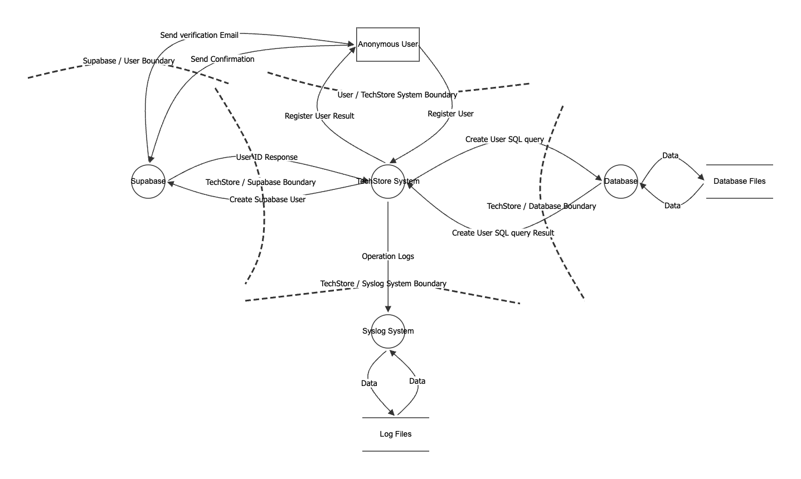
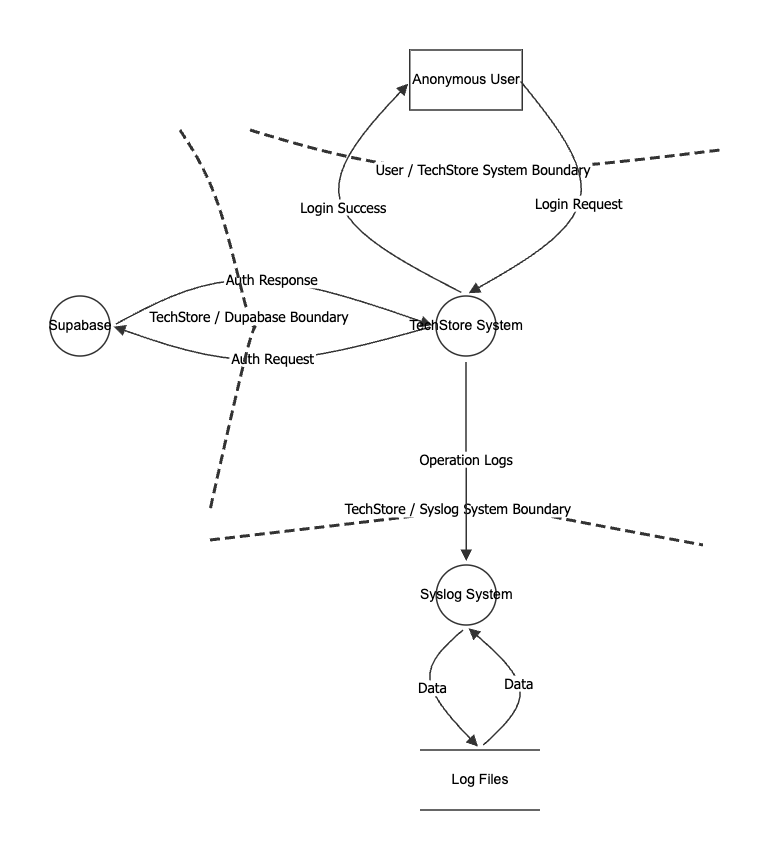
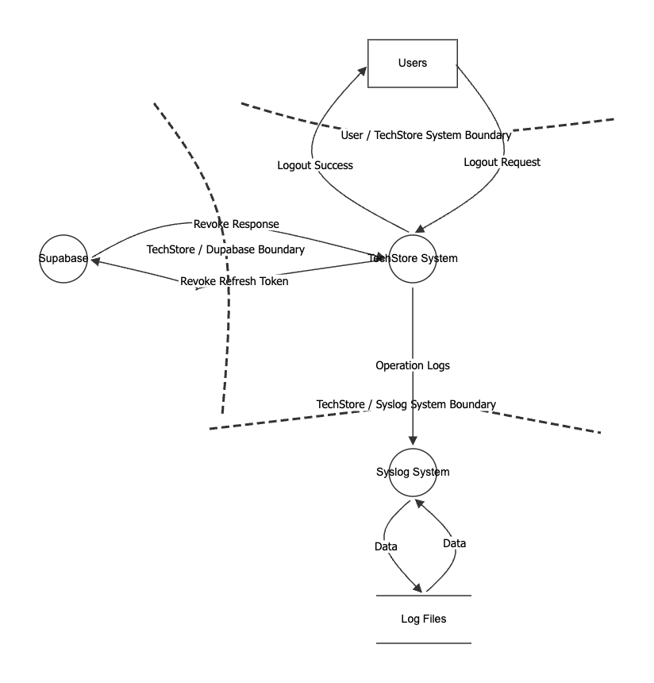
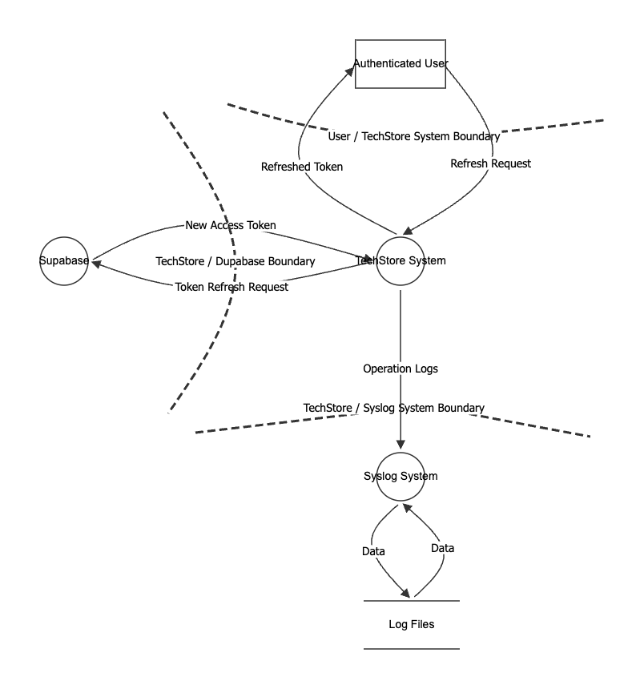

# Desenvolvimento de Software Seguro

## Project - Phase 1

| Name | Student Number |
| --- | ---: |
| Diogo Martins | 1221223 |
| Francisco Osorio | 1220846 |
| Joao Pinto | 1220663 |
| Francisco Reis | 1201373 |
| Marco Marques | 1250685 |

# Introduction

# Analysis

## Functional Requirements

| ID      | Requirement                                                                           |
|---------|---------------------------------------------------------------------------------------|
| **FR1** | The system shall allow users to register.       |
| **FR2** | The system shall allow users to log in and log out.                     |
| **FR3** | The customer shall be able to update their personal information. |
| **FR4** | The system shall provide password recovery functionality. |
| **FR5** | The system shall display a list of available products. |
| **FR6** | The system shall allow users to search for products by name. |
| **FR7** | The system shall allow filtering products by category. |
| **FR8** | The system shall display product details (price, description, stock). |
| **FR9** | The customer shall be able to add products to the cart. |
| **FR10** | The customer shall be able to remove products from the cart. |
| **FR11** | The customer shall be able to update product quantities from the Cart. |
| **FR12** | The system shall automatically calculate the cart total. |
| **FR13** | The customer shall be able to place an order from the cart. |
| **FR14** | The system shall validate product stock before confirming the order. |
| **FR15** | The system shall store the user's order history. |
| **FR16** | The customer shall be able to view the order status. |
| **FR17** | The system shall send an order confirmation email to the user. |
| **FR18** | The carrier user shall view a list of orders ready for pickup.|
| **FR19** | The carrier user shall display relevant order information for pickup.|
| **FR20** | The carrier user shall mark an order as picked up.|
| **FR21** | The manager user shall be able to add new products.|
| **FR22** | The manager user shall be able to edit existing product information.|
| **FR23** | The manager user shall be able to activate or deactivate products from the catalog.|
| **FR24** | The manager user shall be able to manage product categories. |
| **FR25** | The manager user shall be able to update product stock levels manually.|
| **FR26** | The manager user shall be able to view and filter all customer orders in the backoffice.|
| **FR27** | The manager user shall be able to view sales reports by period.|

## Non-Functional Requirements

| ID        | Requirement                                                                                                                                               |
|-----------|-----------------------------------------------------------------------------------------------------------------------------------------------------------|
| **NFR1**  | The API must be available only through HTTPS (TLS 1.2 or higher) in non-local environments.                                                               |
| **NFR2**  | User passwords must be hashed with a strong adaptive algorithm (e.g., BCrypt) before persistence.                                                         |
| **NFR3**  | The system must enforce role-based access control (RBAC) with deny-by-default authorization.                                                              |
| **NFR4**  | The API must mitigate common web threats (SQL Injection, XSS, CSRF where applicable) through input validation, parameterized queries, and secure headers. |
| **NFR5**  | Security-relevant actions (authentication, authorization failures, and critical data changes) must be logged with timestamp and user context.             |
| **NFR6**  | Two-factor authentication is mandatory to all users.                                                                                                      |
| **NFR7**  | The system must handle at least 100 concurrent requests with response time below 500 ms.                                                                  |
| **NFR8**  | The codebase must follow clean architecture principles.                                                                                                   |
| **NFR9**  | CI/CD pipelines must run automatically on pull requests and include build, tests, and security checks before merge.                                       |
| **NFR10** | The application must be deployable as containers using non-root execution and minimal runtime image principles (preferably with Docker Hardened images).  |
| **NFR11** | The API must follow REST conventions, returning correct HTTP status codes and consistent structured error responses.                                      |
| **NFR12** | The API must provide and maintain OpenAPI documentation for all public endpoints, inputs, outputs, and error cases.                                       |
| **NFR13** | Dependency vulnerability scanning (SCA) must run in CI, with no Critical vulnerabilities allowed in release builds.                                       |
| **NFR14** | Automated tests must ensure minimum 80% line coverage in service/domain layers and include security-related test cases.                                   |
| **NFR15** | Secrets (keys, tokens, passwords) must not be stored in source code; secret scanning must be enabled in the repository.                                   |

## Security Requirements

### Authentication and Access Control
- **SR1.** The user authentication must implement Multi-Factor Authentication (MFA) to enhance security.

- **SR2.** The system must lock user accounts after 5 consecutive failed login attempts to prevent brute-force attacks, requiring the user to wait a defined cooldown period before attempting to log in again.

- **SR3.** The password must contain at least 12 characters, including uppercase letters, lowercase letters, numbers, and special characters.

- **SR4.** The system must send a confirmation email after a successful registration to verify the user identity.

- **SR5.** The system must use role-based access control (RBAC) to restrict access to sensitive features based on user roles.

- **SR6.** Authenticated sessions should automatically expire after a period of inactivity.

- **SR7.** The system must implement a rate limiting mechanism to prevent abuse of entry endpoints.

### Data Protection

- **SR8.** All sensitive data must be encrypted, both at rest and in transit, ensuring secure communication and storage.

- **SR9.** Passwords must be hashed using strong algorithms (e.g., bcrypt) before being stored in the database.

- **SR10.** Collected personal data must be handled in compliance with relevant GDPR regulations, being used only for specified purposes and not retained longer than necessary.

### Input Validation and Error Handling

- **SR11.** The system must validate all user inputs to prevent common vulnerabilities such as SQL injection and cross-site scripting (XSS).

- **SR12.** The system must validate the user-submitted data, rejecting any input that does not conform to expected formats.

### Logging and Monitoring

- **SR13.** All logs of sensitive actions must be securely stored and protected against unauthorized access to ensure integrity and confidentiality.

- **SR14.** All logs must perform three backup copies, one stored locally and another two stored in a secure cloud storage service, to ensure data durability and availability in case of local failures.

## Use Cases

## Domain Model

# Design

## Threat Modelling

- **Application Name**: TechStore API
- **Application Version**: 1.0.0
- **Description**: The TechStore API is a E-commerce Restful API focused on sellig technology products, such as computers, smartphones, electonics and more. The API support multiple roles, such as customers, managers and carriers. 

  As a customer you can browse products, manage a shopping cart, and place orders. Managers are responsible for managing products, categories, stock levels, viewing orders, and inviting new users (managers or carriers). Carriers handle order pickup and update delivery status. Invited users complete their registration through a invitation process and an anonymous user can also register in the system as a customer, log in , log out, recover your password and browse products.

  The application will be developed using Java with the Spring Boot framework and will use a relational database, PostgreSQL. Furthermore, the application uses external services for authentication and authorization, and email notifications.

- **Document Owner**: Diogo Martins, Francisco Osório, Francisco Reis, João Araújo, Marco Marques
- **Participants**: Diogo Martins, Francisco Osório, Francisco Reis, João Araújo, Marco Marques
- **Reviewers**: Diogo Martins, Francisco Osório, Francisco Reis, João Araújo, Marco Marques 

## External Dependencies

External dependencies are items external to the code of the application that may pose a threat to the application. These items are fundamental for the safe and efficient operation of the API, so it is important to identify and analyze them.

| ID | Description                                                                                                                                                                                                                                                                                                              |
|----|--------------------------------------------------------------------------------------------------------------------------------------------------------------------------------------------------------------------------------------------------------------------------------------------------------------------------|
| 1  | **Supabase Identity Provider** - Handles authentication and RBAC via OAuth 2.0/OIDC. Issues and rotates JWTs used to authenticate every protected API request.                                                                                                                                                           |
| 2  | **PostgreSQL Relational Database** - External managed database used to store and retrieve all business data (products, orders, carts, audit logs). Accessed by the backend via JDBC using authenticated, least-privilege credentials over TLS.                                                                           |
| 3  | **Email Server (SMTP)** - Cloud email delivery service used via Spring Boot Mail Starter to send transactional emails (order confirmations, password recovery, security alerts). Credentials stored as environment secrets and never hardcoded.                                                                          |                                        |
| 4  | **Docker** - Containerizes the backend and supporting services for consistent, isolated deployment across environments.                                                                                                                                                                                                  |
| 5  | **Firewall and Network Security** - Restricts exposed ports to 443 (HTTPS) and filters all other inbound/outbound traffic at the infrastructure level.                                                                                                                                                                   |
| 6  | **HTTPS / TLS Certificates** - Enforces encrypted communication on all API endpoints. Plaintext HTTP is rejected; certificates must be publicly trusted and kept current.                                                                                                                                                |
| 7  | **Syslog Server** - Centralized logging service that aggregates security-relevant events (authentication and orders) from the backend for auditing, monitoring, and incident response.                                                                                                                                   |
| 8  | **Backup Storage Services** - Stores encrypted backups of all application data following the 3-2-1 rule: at least three copies, on two separate storage media, with one kept off-site. Backups are performed with a defined frequency and all copies are encrypted at rest to prevent unauthorized access or disclosure. |
| 9  | **Java Runtime Environment (JRE)** - Required to run the backend. Must be kept on an actively maintained version to avoid known runtime vulnerabilities.                                                                                                                                                                 |
| 10 | **Third-party Libraries (SBOM)** - External libraries used in development (e.g., Spring Boot, Spring Security, Hibernate). An SBOM will be maintained and libraries scanned via SCA tooling.                                                                                                                             |
| 11 | **Bucket4j (Rate Limiter)** - Spring Boot-compatible library used to enforce request rate limits on authentication endpoints (login, registration, password recovery), protecting against brute force and credential stuffing attacks.                                                                                   |
| 12 | **Secret Management** - Database passwords, API keys, SMTP credentials, and JWT secrets are injected via environment variables at runtime and never stored in the repository.                                                                                                                                            |
| 13 | **CI/CD Pipeline** (e.g., GitHub Actions) - Automates build, test, and deployment with integrated security gates (SAST, SCA, automated tests) on every code change.                                                                                                                                                      |
| 14 | **SAST / SCA Tools** (e.g., SonarQube, OWASP Dependency-Check) - Identifies vulnerabilities in source code and third-party dependencies; integrated into the CI/CD pipeline.                                                                                                                                             |

## Trust Levels

| ID | Name | Description |
| --- | --- | --- |
| 1 | Anonymous User | A user who has not logged. Can browse the products catalogue and perform products searchs but cannot access any functionality that requires authentication. |
| 2 | Customer | A registered and logged user on the system, can manage their account, buy products, and access all the features available to authenticated users. |
| 3 | Manager | A user with administrative privileges, can manage the system and its resources, activate or deactivate products, update products stock level and information, add new products, invites new carriers and managers. |
| 4 | Carrier | A user responsible for delivering products to customers, can view orders ready to pick up, view order information for pick up, and mark orders as delivered. |
| 5 | Invited User | A user who has been invited to join the system but has not yet accepted the invitation. They have the same access as a anonymous user until they accept the invitation, and then they can become a Manager or Carrier. |

## Entry Points

|ID|Name|Description|Trust Level|
|--|----|-----------|-----------|
|1| HTTPs Port| The API will be only acessible via TLS encrypted HTTPs connections. | Anonymous User, Customer, Carrier, Manager, Invited User |
|2| POST /api/auth/register| The register endpoint allows unregistered users to create a new account as a customer. | Anonymous User |
|3| POST /api/auth/login| The login endpoint allows users to authenticate and obtain a JWT token for subsequent requests. | Anonymous User |
|4| POST /api/auth/logout| The logout endpoint allows authenticated users to invalidate their JWT token and end their session. | Customer, Carrier, Manager |
|5| POST /api/auth/refresh| The refresh endpoint allows authenticated users to obtain a new JWT token before the current one expires. | Customer, Carrier, Manager |
|6| POST /api/auth/invite| The invite endpoint allows managers to invite new users (managers or carriers) to the system. | Manager |
|7| POST /api/auth/confirm-invite| The confirm invite endpoint allows invited users to complete their registration process. | Invited User |
|8| POST /api/auth/reset-password| The reset password endpoint allows users to request a password reset link via email. | Anonymous User |
|9| GET /api/products| The products endpoint allows users to retrieve a list of available products. | Anonymous User, Customer, Carrier, Manager, Invited User |
|10| GET /api/products/search?productName={name}| The products endpoint allows users to search for products by name. | Anonymous User, Customer, Carrier, Manager, Invited User |
|11| POST /api/products| The products endpoint allows managers to create new products. | Manager |
|12| PATCH /api/products/{id}| The products endpoint allows managers to update existing products. | Manager |
|13| GET /api/cart | The cart endpoint allows customers to view the contents of their shopping cart. | Customer |
|14| POST /api/cart/items | The cart endpoint allows customers to add products to their shopping cart. | Customer |
|15| PUT /api/cart/items/{productId} | The cart endpoint allows customers to update the quantity of a product in their shopping cart. | Customer |
|16| DELETE /api/cart/items/{productId} | The cart endpoint allows customers to remove a product from their shopping cart. | Customer |
|17| POST /api/orders | The orders endpoint allows customers to place a new order based on the contents of their shopping cart. | Customer |
|18| GET /api/orders | The orders endpoint allows customers to view their order history. | Customer |
|19| GET /api/carrier/orders | The carrier orders endpoint allows carriers to view the orders assigned to them for delivery. | Carrier |
|20| PATCH /api/carrier/{orderId}/pickup | The carrier orders endpoint allows carriers to update the status of an order to "picked up". | Carrier |
|21| POST /api/manager/backup | The manager backup endpoint allows managers to create a backup of the products, categories, and orders data. | Manager |

## Exit Points

## Assets

## Data Flow Diagrams

### Register Unauthenticated User

### User Login

### User Logout

### Refresh User Token

## Determine and Rank Threats

### Categorization

### Analysis

### STRIDE

## Attack Trees

## Abuse Cases

## Ranking of Threats - DREAD

## Qualitative Risk Model

## Countermeasures and Mitigations

These are the terms used in the context of cybersecurity to describe actions taken to reduce or eliminate the vulnerabilities and risks associated with cyber threats. Once the threats and the corresponding vulnerabilities have been identified, it is possible to derive a threat profile with the following criteria:

- **Non mitigated threats**: Threats which have no countermeasures and represent vulnerabilities that can be fully exploited and cause an impact.
- **Partially mitigated threats**: Threats partially mitigated by one or more countermeasures and can only partially be exploited to cause a limited impact.
- **Full mitigated threats**: These threats have appropriate countermeasures in place and do not expose vulnerabilities.

In the next table we can see the implementation of the countermeasures in the premise of this project.

| STRIDE                  | Countermeasures |
|-------------------------|----------------|
| **Spoofing**            | - Strong password policy   - Multi-Factor Authentication (MFA)   - Token-based authentication   - Rate limiting and account lockout mechanisms   - Secure session management (timeouts, rotation)   - Do not store secrets in code |
| **Tampering**           | - Input sanitization and validation   - Code audits   - Use HTTPS/TLS for data in transit   - Integrity checks (HMAC, digital signatures)   - Secure hashing with salt   - Proper authorization |
| **Repudiation**         | - Timestamps   - Audit trails and logging   - Centralized logging and monitoring   - Log integrity protection (append-only, signed logs) |
| **Information Disclosure** | - Encryption (data at rest and in transit)   - Proper authorization and access control   - Do not store secrets in code   - Sanitize error messages (avoid verbose errors)   - Prevent user/email enumeration   - Secure logging (no sensitive data exposure)   - Data minimization and masking |
| **Denial of Service**   | - Rate limiting and throttling   - Filtering (WAF, IP blocking)   - CAPTCHA / bot detection   - Load balancing and autoscaling   - Quality of Service (QoS) mechanisms |
| **Elevation of Privilege** | - Least privilege principle   - Role-Based Access Control (RBAC)   - Proper authorization checks   - Privilege separation   - Secure coding practices |

## Secure Design

## Conclusion
